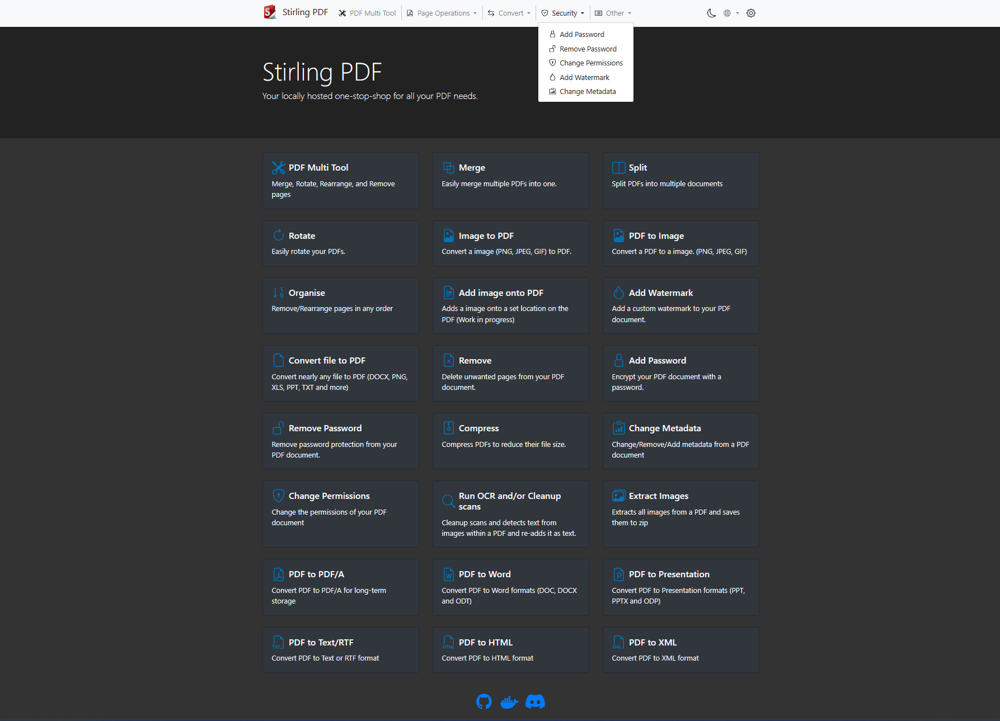

<p align="center"><br><h1 align="center">Stirling-PDF</h1>
</p>

[](https://hub.docker.com/r/frooodle/s-pdf)
[](https://discord.gg/Cn8pWhQRxZ)
[](https://github.com/Frooodle/Stirling-PDF/)
[](https://github.com/Frooodle/stirling-pdf)
[](https://www.paypal.com/paypalme/froodleplex)
[](https://github.com/sponsors/Frooodle)

This is a powerful locally hosted web based PDF manipulation tool using docker that allows you to perform various operations on PDF files, such as splitting merging, converting, reorganizing, adding images, rotating, compressing, and more. This locally hosted web application started as a 100% ChatGPT-made application and has evolved to include a wide range of features to handle all your PDF needs.

Stirling PDF makes no outbount calls for any record keeping or tracking.

All files and PDFs are either purely client side, in server memory only during the execution of the task or within a temporay file only for execution of the task.
Any file which has been downloaded by the user will have already been deleted from the server by that time.

Feel free to request any features or bug fixes either in github issues or our [Discord](https://discord.gg/Cn8pWhQRxZ)




## Features
- Full intractable GUI for merging/splitting/rotating/moving PDFs and their pages.
- Split PDFs into multiple files at specified page numbers or extract all pages as individual files.
- Merge multiple PDFs together into a single resultant file
- Convert PDFs to and from images
- Reorganize PDF pages into different orders.
- Add/Generate signatures
- Flatten PDFs
- Repair PDFs
- Detect and remove blank pages
- Compare 2 PDFs and show differences in text
- Add images to PDFs
- Rotating PDFs in 90 degree increments.
- Compressing PDFs to decrease their filesize. (Using OCRMyPDF)
- Add and remove passwords
- Set PDF Permissions
- Add watermark(s)
- Convert Any common file to PDF (using LibreOffice)
- Convert PDF to Word/Powerpoint/Others (using LibreOffice)
- Extract images from PDF
- OCR on PDF (Using OCRMyPDF)
- Edit metadata
- Dark mode support.
- Custom download options (see [here](https://github.com/Frooodle/Stirling-PDF/blob/main/images/settings.png) for example)
- Parallel file processing and downloads
- API for integration with external scripts 

For a overview of the tasks and the technology each uses please view [groups.md](https://github.com/Frooodle/Stirling-PDF/blob/main/Groups.md)
Hosted instance/demo of the app can be seen [here](https://pdf.adminforge.de/) hosted by the team at adminforge.de

## Technologies used
- Spring Boot + Thymeleaf
- PDFBox
- [LibreOffice](https://www.libreoffice.org/discover/libreoffice/) for advanced conversions
- [OcrMyPdf](https://github.com/ocrmypdf/OCRmyPDF)
- HTML, CSS, JavaScript
- Docker
- PDF.js
- PDF-LIB.js

## How to use

### Locally
Please view https://github.com/Frooodle/Stirling-PDF/blob/main/LocalRunGuide.md

### Docker
https://hub.docker.com/r/frooodle/s-pdf

Docker Run
```
docker run -d \
  -p 8080:8080 \
  -v /location/of/trainingData:/usr/share/tesseract-ocr/4.00/tessdata \
  --name stirling-pdf \
  frooodle/s-pdf
  
  
  Can also add these for customisation but are not required
  -e APP_HOME_NAME="Stirling PDF" \
  -e APP_HOME_DESCRIPTION="Your locally hosted one-stop-shop for all your PDF needs." \
  -e APP_NAVBAR_NAME="Stirling PDF" \
  -e ALLOW_GOOGLE_VISIBILITY="true" \
  -e APP_ROOT_PATH="/" \
  -e APP_LOCALE="en_GB" \
```
Docker Compose
```
version: '3.3'
services:
  stirling-pdf:
    image: frooodle/s-pdf
    ports:
      - '8080:8080'
    volumes:
      - /location/of/trainingData:/usr/share/tesseract-ocr/4.00/tessdata #Required for extra OCR languages
#      - /location/of/extraConfigs:/configs
#    environment:
#      APP_LOCALE: en_GB
#      APP_HOME_NAME: Stirling PDF
#      APP_HOME_DESCRIPTION: Your locally hosted one-stop-shop for all your PDF needs.
#      APP_NAVBAR_NAME: Stirling PDF
#      APP_ROOT_PATH: /
#      ALLOW_GOOGLE_VISIBILITY: true

```


## Enable OCR/Compression feature
Please view https://github.com/Frooodle/Stirling-PDF/blob/main/HowToUseOCR.md

## Want to add your own language?
Stirling PDF currently supports
- English (English) (en_GB)
- Arabic (العربية) (ar_AR)
- German (Deutsch) (de_DE)
- French (Français) (fr_FR)
- Spanish (Español) (es_ES)
- Chinese (简体中文) (it_IT)
- Catalan (Català) (zh_CN)
- Italian (Italiano) (ca_CA)
- Swedish (Svenska) (sv_SE)
- Polish (Polski) (pl_PL)

If you want to add your own language to Stirling-PDF please refer
https://github.com/Frooodle/Stirling-PDF/blob/main/HowToAddNewLanguage.md

And please create a PR to merge it back in so others can use it! 

Also please note as i add new features i will google translate existing languages so that they dont lose support. This could mean that new features need grammer corrections as added.

## How to View
1. Open a web browser and navigate to `http://localhost:8080/`
2. Use the application by following the instructions on the website.


## Customize App
Stirling PDF allows easy customization of the visible application name.
Simply use environment variables APP_HOME_NAME, APP_HOME_DESCRIPTION and APP_NAVBAR_NAME with Docker or Java. 
If running Java directly, you can also pass these as properties using -D arguments.

Using the same method you can also change 

- The default language by providing APP_LOCALE with values like de-DE fr-FR or ar-AR (Note the - character not _ ) to select your default language (Will always default to English on invalid locale) Current accepted locales can be seen above in the Want to add your own language section
- Enable/Disable search engine visiblility with ALLOW_GOOGLE_VISIBILITY with true / false values. Default disable visiblility.
- Change root URI for Stirling-PDF ie change server.com/ to server.com/pdf-app by running APP_ROOT_PATH as pdf-app
- Disable and remove endpoints and functionality from Stirling-PDF. Currently the endpoints ENDPOINTS_TO_REMOVE and GROUPS_TO_REMOVE can include comma seperated lists of endpoints and groups to disable as example ENDPOINTS_TO_REMOVE=img-to-pdf,remove-pages would disable both image to pdf and remove pages, GROUPS_TO_REMOVE=LibreOffice Would disable all things that use LibreOffice. You can see a list of all endpoints and groups [here](https://github.com/Frooodle/Stirling-PDF/blob/main/Groups.md) 


## API
For those wanting to use Stirling-PDFs backend API to link with their own custom scripting to edit PDFs you can view all existing API documentation
[here](https://app.swaggerhub.com/apis-docs/Frooodle/Stirling-PDF/) or navigate to /swagger-ui/index.html of your stirling-pdf instance for your versions documentation 
