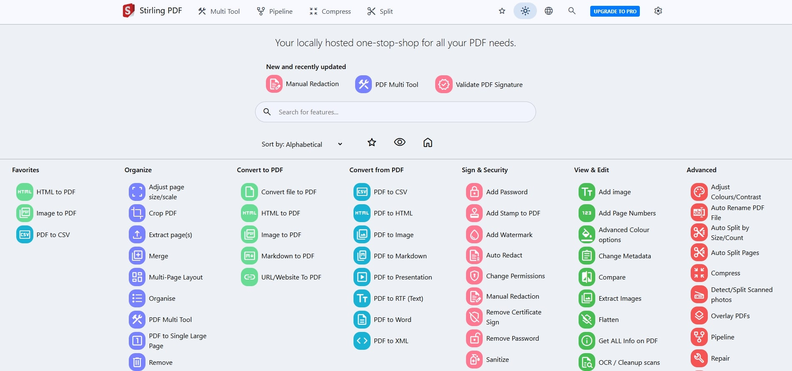
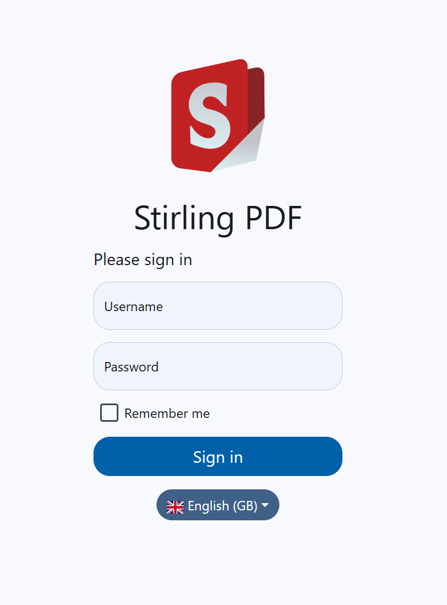

<p align="center"></p>
<h1 align="center">Stirling-PDF</h1>

[](https://hub.docker.com/r/frooodle/s-pdf)
[](https://discord.gg/Cn8pWhQRxZ)
[](https://github.com/Stirling-Tools/Stirling-PDF/)
[](https://github.com/Stirling-Tools/stirling-pdf)
[](https://www.paypal.com/donate/?hosted_button_id=MN7JPG5G6G3JL)
[](https://github.com/sponsors/Frooodle)

[](https://cloud.digitalocean.com/apps/new?repo=https://github.com/Stirling-Tools/Stirling-PDF/tree/digitalOcean&refcode=c3210994b1af)
[](https://www.ssdnodes.com/manage/aff.php?aff=2216&register=true)

This is a robust, locally hosted web-based PDF manipulation tool using Docker. It enables you to carry out various operations on PDF files, including splitting, merging, converting, reorganizing, adding images, rotating, compressing, and more. This locally hosted web application has evolved to encompass a comprehensive set of features, addressing all your PDF requirements.

Stirling PDF does not initiate any outbound calls for record-keeping or tracking purposes.

All files and PDFs exist either exclusively on the client side, reside in server memory only during task execution, or temporarily reside in a file solely for the execution of the task. Any file downloaded by the user will have been deleted from the server by that point.



## Features

- Dark mode support.
- Custom download options
- Parallel file processing and downloads
- API for integration with external scripts
- Optional Login and Authentication support (see [here](https://github.com/Stirling-Tools/Stirling-PDF/tree/main#login-authentication) for documentation)
- Database Backup and Import (see [here](https://github.com/Stirling-Tools/Stirling-PDF/blob/main/DATABASE.md) for documentation)

## **PDF Features**

### **Page Operations**

- View and modify PDFs - View multi page PDFs with custom viewing sorting and searching. Plus on page edit features like annotate, draw and adding text and images. (Using PDF.js with Joxit and Liberation.Liberation fonts)
- Full interactive GUI for merging/splitting/rotating/moving PDFs and their pages.
- Merge multiple PDFs together into a single resultant file.
- Split PDFs into multiple files at specified page numbers or extract all pages as individual files.
- Reorganize PDF pages into different orders.
- Rotate PDFs in 90-degree increments.
- Remove pages.
- Multi-page layout (Format PDFs into a multi-paged page).
- Scale page contents size by set %.
- Adjust Contrast.
- Crop PDF.
- Auto Split PDF (With physically scanned page dividers).
- Extract page(s).
- Convert PDF to a single page.

### **Conversion Operations**

- Convert PDFs to and from images.
- Convert any common file to PDF (using LibreOffice).
- Convert PDF to Word/Powerpoint/Others (using LibreOffice).
- Convert HTML to PDF.
- URL to PDF.
- Markdown to PDF.

### **Security & Permissions**

- Add and remove passwords.
- Change/set PDF Permissions.
- Add watermark(s).
- Certify/sign PDFs.
- Sanitize PDFs.
- Auto-redact text.

### **Other Operations**

- Add/Generate/Write signatures.
- Repair PDFs.
- Detect and remove blank pages.
- Compare 2 PDFs and show differences in text.
- Add images to PDFs.
- Compress PDFs to decrease their filesize (Using OCRMyPDF).
- Extract images from PDF.
- Extract images from Scans.
- Add page numbers.
- Auto rename file by detecting PDF header text.
- OCR on PDF (Using OCRMyPDF).
- PDF/A conversion (Using OCRMyPDF).
- Edit metadata.
- Flatten PDFs.
- Get all information on a PDF to view or export as JSON.

For a overview of the tasks and the technology each uses please view [Endpoint-groups.md](https://github.com/Stirling-Tools/Stirling-PDF/blob/main/Endpoint-groups.md)

Demo of the app is available [here](https://stirlingpdf.io).

## Technologies used

- Spring Boot + Thymeleaf
- [PDFBox](https://github.com/apache/pdfbox/tree/trunk)
- [LibreOffice](https://www.libreoffice.org/discover/libreoffice/) for advanced conversions
- [OcrMyPdf](https://github.com/ocrmypdf/OCRmyPDF)
- HTML, CSS, JavaScript
- Docker
- [PDF.js](https://github.com/mozilla/pdf.js)
- [PDF-LIB.js](https://github.com/Hopding/pdf-lib)

## How to use

### Locally

Please view https://github.com/Stirling-Tools/Stirling-PDF/blob/main/LocalRunGuide.md

### Docker / Podman

https://hub.docker.com/r/frooodle/s-pdf

Stirling PDF has 3 different versions, a Full version and ultra-Lite version as well as a 'Fat' version. Depending on the types of features you use you may want a smaller image to save on space.
To see what the different versions offer please look at our [version mapping](https://github.com/Stirling-Tools/Stirling-PDF/blob/main/Version-groups.md)
For people that don't mind about space optimization just use the latest tag.


Please note in below examples you may need to change the volume paths as needed, current examples install them to the current working directory
eg ``./extraConfigs:/configs`` to ``/opt/stirlingpdf/extraConfigs:/configs``

### Docker Run

```bash
docker run -d \
  -p 8080:8080 \
  -v ./trainingData:/usr/share/tessdata \
  -v ./extraConfigs:/configs \
  -v ./logs:/logs \
  -e DOCKER_ENABLE_SECURITY=false \
  -e INSTALL_BOOK_AND_ADVANCED_HTML_OPS=false \
  -e LANGS=en_GB \
  --name stirling-pdf \
  frooodle/s-pdf:latest

  Can also add these for customisation but are not required

  -v /location/of/customFiles:/customFiles \
```

### Docker Compose

```yaml
version: '3.3'
services:
  stirling-pdf:
    image: frooodle/s-pdf:latest
    ports:
      - '8080:8080'
    volumes:
      - ./trainingData:/usr/share/tessdata #Required for extra OCR languages
      - ./extraConfigs:/configs
#      - ./customFiles:/customFiles/
#      - ./logs:/logs/
    environment:
      - DOCKER_ENABLE_SECURITY=false
      - INSTALL_BOOK_AND_ADVANCED_HTML_OPS=false
      - LANGS=en_GB
```

Note: Podman is CLI-compatible with Docker, so simply replace "docker" with "podman".

## Enable OCR/Compression feature

Please view https://github.com/Stirling-Tools/Stirling-PDF/blob/main/HowToUseOCR.md

## Supported Languages

Stirling PDF currently supports 33!

| Language                                    | Progress                               |
| ------------------------------------------- | -------------------------------------- |
| English (English) (en_GB)                   |  |
| English (US) (en_US)                        |  |
| Arabic (العربية) (ar_AR)                    |    |
| German (Deutsch) (de_DE)                    |  |
| French (Français) (fr_FR)                   |    |
| Spanish (Español) (es_ES)                   |    |
| Simplified Chinese (简体中文) (zh_CN)       |    |
| Traditional Chinese (繁體中文) (zh_TW)      |    |
| Catalan (Català) (ca_CA)                    |    |
| Italian (Italiano) (it_IT)                  |    |
| Swedish (Svenska) (sv_SE)                   |    |
| Polish (Polski) (pl_PL)                     |    |
| Romanian (Română) (ro_RO)                   |    |
| Korean (한국어) (ko_KR)                     |    |
| Portuguese Brazilian (Português) (pt_BR)    |    |
| Portuguese (Português) (pt_PT)              |    |
| Russian (Русский) (ru_RU)                   |    |
| Basque (Euskara) (eu_ES)                    |    |
| Japanese (日本語) (ja_JP)                   |    |
| Dutch (Nederlands) (nl_NL)                  |    |
| Greek (Ελληνικά) (el_GR)                    |    |
| Turkish (Türkçe) (tr_TR)                    |    |
| Indonesia (Bahasa Indonesia) (id_ID)        |    |
| Hindi (हिंदी) (hi_IN)                          |    |
| Hungarian (Magyar) (hu_HU)                  |    |
| Bulgarian (Български) (bg_BG)               |    |
| Sebian Latin alphabet (Srpski) (sr_LATN_RS) |    |
| Ukrainian (Українська) (uk_UA)              |    |
| Slovakian (Slovensky) (sk_SK)               |    |
| Czech (Česky) (cs_CZ)                       |    |
| Croatian (Hrvatski) (hr_HR)                 |    |
| Norwegian (Norsk) (no_NB)                   |    |
| Thai (ไทย) (th_TH)                          |  |

## Contributing (creating issues, translations, fixing bugs, etc.)

Please see our [Contributing Guide](CONTRIBUTING.md)!

## Customisation

Stirling PDF allows easy customization of the app.
Includes things like

- Custom application name
- Custom slogans, icons, HTML, images CSS etc (via file overrides) 

There are two options for this, either using the generated settings file ``settings.yml``
This file is located in the ``/configs`` directory and follows standard YAML formatting

Environment variables are also supported and would override the settings file
For example in the settings.yml you have

```yaml
security:
  enableLogin: 'true'
```

To have this via an environment variable you would have ``SECURITY_ENABLELOGIN``

The Current list of settings is

```yaml
security:
  enableLogin: false # set to 'true' to enable login
  csrfDisabled: true # Set to 'true' to disable CSRF protection (not recommended for production)
  loginAttemptCount: 5 # lock user account after 5 tries
  loginResetTimeMinutes: 120 # lock account for 2 hours after x attempts
  loginMethod: all # 'all' (Login Username/Password and OAuth2[must be enabled and configured]), 'normal'(only Login with Username/Password) or 'oauth2'(only Login with OAuth2)
  initialLogin:
    username: '' # Initial username for the first login
    password: '' # Initial password for the first login
  oauth2:
    enabled: false # set to 'true' to enable login (Note: enableLogin must also be 'true' for this to work)
    client:
      keycloak:
        issuer: '' # URL of the Keycloak realm's OpenID Connect Discovery endpoint
        clientId: '' # Client ID for Keycloak OAuth2
        clientSecret: '' # Client Secret for Keycloak OAuth2
        scopes: openid, profile, email # Scopes for Keycloak OAuth2
        useAsUsername: preferred_username # Field to use as the username for Keycloak OAuth2
      google:
        clientId: '' # Client ID for Google OAuth2
        clientSecret: '' # Client Secret for Google OAuth2
        scopes: https://www.googleapis.com/auth/userinfo.email, https://www.googleapis.com/auth/userinfo.profile # Scopes for Google OAuth2
        useAsUsername: email # Field to use as the username for Google OAuth2
      github:
        clientId: '' # Client ID for GitHub OAuth2
        clientSecret: '' # Client Secret for GitHub OAuth2
        scopes: read:user # Scope for GitHub OAuth2
        useAsUsername: login # Field to use as the username for GitHub OAuth2
    issuer: '' # set to any provider that supports OpenID Connect Discovery (/.well-known/openid-configuration) end-point
    clientId: '' # Client ID from your provider
    clientSecret: '' # Client Secret from your provider
    autoCreateUser: false # set to 'true' to allow auto-creation of non-existing users
    useAsUsername: email # Default is 'email'; custom fields can be used as the username
    scopes: openid, profile, email # Specify the scopes for which the application will request permissions
    provider: google # Set this to your OAuth provider's name, e.g., 'google' or 'keycloak'

system:
  defaultLocale: 'en-US' # Set the default language (e.g. 'de-DE', 'fr-FR', etc)
  googlevisibility: false # 'true' to allow Google visibility (via robots.txt), 'false' to disallow
  enableAlphaFunctionality: false # Set to enable functionality which might need more testing before it fully goes live (This feature might make no changes)
  showUpdate: true # see when a new update is available
  showUpdateOnlyAdmin: false # Only admins can see when a new update is available, depending on showUpdate it must be set to 'true'
  customHTMLFiles: false # enable to have files placed in /customFiles/templates override the existing template html files

ui:
  appName: '' # Application's visible name
  homeDescription: '' # Short description or tagline shown on homepage.
  appNameNavbar: '' # Name displayed on the navigation bar

endpoints:
  toRemove: [] # List endpoints to disable (e.g. ['img-to-pdf', 'remove-pages'])
  groupsToRemove: [] # List groups to disable (e.g. ['LibreOffice'])

metrics:
  enabled: true # 'true' to enable Info APIs (`/api/*`) endpoints, 'false' to disable
```

There is an additional config file ``/configs/custom_settings.yml`` were users familiar with java and spring application.properties can input their own settings on-top of Stirling-PDFs existing ones

### Extra notes

- Endpoints. Currently, the endpoints ENDPOINTS_TO_REMOVE and GROUPS_TO_REMOVE can include comma separate lists of endpoints and groups to disable as example ENDPOINTS_TO_REMOVE=img-to-pdf,remove-pages would disable both image-to-pdf and remove pages, GROUPS_TO_REMOVE=LibreOffice Would disable all things that use LibreOffice. You can see a list of all endpoints and groups [here](https://github.com/Stirling-Tools/Stirling-PDF/blob/main/Endpoint-groups.md)
- customStaticFilePath. Customise static files such as the app logo by placing files in the /customFiles/static/ directory. An example of customising app logo is placing a /customFiles/static/favicon.svg to override current SVG. This can be used to change any images/icons/css/fonts/js etc in Stirling-PDF

### Environment only parameters

- ``SYSTEM_ROOTURIPATH`` ie set to ``/pdf-app`` to Set the application's root URI to ``localhost:8080/pdf-app``
- ``SYSTEM_CONNECTIONTIMEOUTMINUTES`` to set custom connection timeout values
- ``DOCKER_ENABLE_SECURITY`` to tell docker to download security jar (required as true for auth login)
- ``INSTALL_BOOK_AND_ADVANCED_HTML_OPS`` to download calibre onto stirling-pdf enabling pdf to/from book and advanced html conversion
- ``LANGS`` to define custom font libraries to install for use for document conversions

## API

For those wanting to use Stirling-PDFs backend API to link with their own custom scripting to edit PDFs you can view all existing API documentation
[here](https://app.swaggerhub.com/apis-docs/Stirling-Tools/Stirling-PDF/) or navigate to /swagger-ui/index.html of your stirling-pdf instance for your versions documentation (Or by following the API button in your settings of Stirling-PDF)

## Login authentication



### Prerequisites

- User must have the folder ./configs volumed within docker so that it is retained during updates.
- Docker users must download the security jar version by setting ``DOCKER_ENABLE_SECURITY`` to ``true`` in environment variables.
- Then either enable login via the settings.yml file or via setting ``SECURITY_ENABLE_LOGIN`` to ``true``
- Now the initial user will be generated with username ``admin`` and password ``stirling``. On login you will be forced to change the password to a new one. You can also use the environment variables ``SECURITY_INITIALLOGIN_USERNAME`` and  ``SECURITY_INITIALLOGIN_PASSWORD`` to set your own straight away (Recommended to remove them after user creation).

Once the above has been done, on restart, a new stirling-pdf-DB.mv.db will show if everything worked.

When you login to Stirling PDF you will be redirected to /login page to login with those default credentials. After login everything should function as normal

To access your account settings go to Account settings in the settings cog menu (top right in navbar) This Account settings menu is also where you find your API key.

To add new users go to the bottom of Account settings and hit 'Admin Settings', here you can add new users. The different roles mentioned within this are for rate limiting. This is a Work in progress which will be expanding on more in future

For API usage you must provide a header with 'X-API-Key' and the associated API key for that user.

## FAQ

### Q1: What are your planned features?

- Progress bar/Tracking
- Full custom logic pipelines to combine multiple operations together.
- Folder support with auto scanning to perform operations on
- Redact text (Via UI not just automated way)
- Add Forms
- Multi page layout (Stich PDF pages together) support x rows y columns and custom page sizing
- Fill forms manually or automatically

### Q2: Why is my application downloading .htm files?

This is an issue caused commonly by your NGINX configuration. The default file upload size for NGINX is 1MB, you need to add the following in your Nginx sites-available file. ``client_max_body_size SIZE;`` Where "SIZE" is 50M for example for 50MB files.

### Q3: Why is my download timing out

NGINX has timeout values by default so if you are running Stirling-PDF behind NGINX you may need to set a timeout value such as adding the config ``proxy_read_timeout 3600;``
