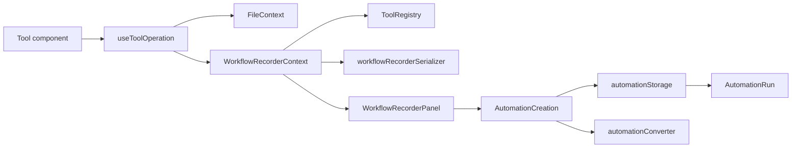
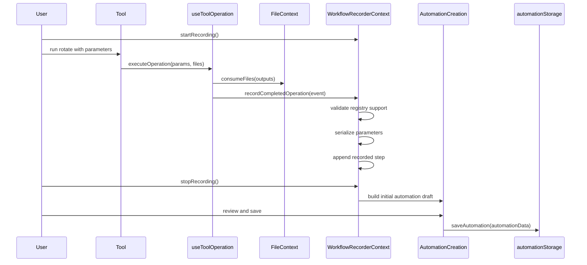

# Automation Workflow Recorder Design

Date: 2026-06-02

## Brief Description

The Automation Workflow Recorder lets users record a live sequence of PDF tool operations and save it as a reusable Automate workflow.

Today, users can manually create an automation by selecting tools and configuring each step. The recorder adds a second path: users start recording, perform their normal document workflow, stop recording, review the captured steps, and save the result as an `AutomationConfig`. The saved automation can then run through the existing Automate tool, export as native Automate JSON, or export as folder-scanning pipeline JSON.

The feature aims to turn real repeated work into reusable automation without requiring users to understand endpoint names, parameter structures, or the current Automate builder up front.

## Motivation

Stirling PDF already supports stateful multi-tool document workflows. Users can upload PDFs once, run tools such as split, rotate, compress, merge, sanitize, and OCR, then keep working with the resulting files without reloading them. That makes the product useful for repeated office workflows, but repeated workflows still require manual setup each time unless the user builds an Automate configuration by hand.

This feature is valuable because it:

- Reduces friction for users who already know how to perform a workflow manually but do not know how to recreate it in Automate.
- Makes Automate easier to discover by showing that a successful manual workflow can become a reusable template.
- Uses actual runtime parameters, so recorded automations are more likely to match what the user meant than a manually assembled sequence.
- Strengthens the current automation system without introducing a second execution engine.
- Supports both browser-based reuse through IndexedDB and server-side folder scanning reuse through the existing export converter.

## Relevant Current System Details

### Multi-Tool File State

`frontend/editor/src/core/contexts/FileContext.tsx` is the central state owner for active PDF files and tool outputs. Tool operations do not bypass it. Successful operations call file actions such as `consumeFiles`, create processed file stubs, preserve parent-child history for version-like operations, and handle resource cleanup for blob URLs and PDF metadata.

The recorder should not own files or persist file bytes. It should only observe successful tool operations and store the operation ID plus parameters needed to replay the tool later.

### Shared Tool Operation Hook

`frontend/editor/src/core/hooks/tools/shared/useToolOperation.ts` is the main execution path for most frontend tools. It receives a `ToolOperationConfig`, validates selected files, checks encrypted-file and backend-readiness conditions, runs the backend request or custom processor, processes output files, updates `FileContext`, and tracks undo state.

`ToolOperationConfig` is defined in `frontend/editor/src/core/hooks/tools/shared/toolOperationTypes.ts`. It includes:

- `operationType`: frontend tool ID used for tracking and automation.
- `toolType`: single-file, multi-file, or custom.
- `endpoint`: static or parameter-derived backend endpoint.
- `buildFormData`: request builder for normal API tools.
- `customProcessor`: custom execution logic for complex tools.
- `defaultParameters`: default values used by Automate.

This hook is the best instrumentation point because it already sees the final runtime parameters and only reaches the result path when a tool succeeds.

### Tool Registry

`frontend/editor/src/core/data/useTranslatedToolRegistry.tsx` builds the tool registry. Registry entries include display metadata, `operationConfig`, optional `automationSettings`, and `supportsAutomate`.

`frontend/editor/src/core/data/toolsTaxonomy.ts` defines `getToolSupportsAutomate`, which defaults tools to automation-compatible unless `supportsAutomate` is explicitly `false`. The recorder should use the same metadata so it records only steps that can be replayed by Automate.

### Automate Storage and Execution

Automate stores saved workflows as `AutomationConfig`:

```ts
interface AutomationConfig {
  id: string;
  name: string;
  description?: string;
  icon?: string;
  operations: AutomationOperation[];
  createdAt: string;
  updatedAt: string;
}

interface AutomationOperation {
  operation: string;
  parameters: Record<string, any>;
}
```

`frontend/editor/src/core/services/automationStorage.ts` persists saved automations in IndexedDB. `frontend/editor/src/core/utils/automationExecutor.ts` executes each operation sequentially by looking up the tool's `operationConfig` in the registry. `frontend/editor/src/core/components/tools/automate/AutomationRun.tsx` displays execution progress.

The recorder should save final workflows through this existing storage layer rather than adding a new database.

### Automation Import and Export

`frontend/editor/src/core/utils/automationConverter.ts` converts native Automate JSON to folder-scanning pipeline JSON and parses both formats back into `AutomationConfig` shape. Folder-scanning JSON stores backend endpoint strings in a `pipeline` array, while native Automate JSON stores frontend tool IDs in an `operations` array.

Because the recorder produces a normal `AutomationConfig`, export to folder scanning remains available without recorder-specific code.

### Backend Pipeline Shape

The backend pipeline models in `app/core/src/main/java/stirling/software/SPDF/model/PipelineConfig.java` and `PipelineOperation.java` already represent a named pipeline with an ordered operation list and parameter map. The recorder does not need a new backend endpoint for the MVP because it can rely on existing Automate execution and export conversion.

## Detailed Design

### User Experience

The recorder adds a "Record workflow" entry point to the Automate tool and a compact recording indicator in the workbench while recording is active.

Primary flow:

1. User opens Automate and selects "Record workflow".
2. The app starts a recording session and returns the user to the normal tool picker/workbench.
3. User runs supported tools as usual.
4. Each successful supported operation is appended to the draft recording.
5. Unsupported or sensitive steps appear in the draft as skipped or incomplete steps with a clear reason.
6. User stops recording from the indicator or Automate panel.
7. Automate opens a review screen prefilled with the recorded steps.
8. User names the automation, edits/removes/reorders steps, fills any missing sensitive values, then saves or exports.

The feature intentionally keeps execution behavior unchanged while recording. If a tool succeeds today, it should still succeed the same way with recording enabled.

### New Frontend Modules

The implementation should add these frontend modules:

```text
frontend/editor/src/core/types/workflowRecorder.ts
frontend/editor/src/core/contexts/workflowRecorder/WorkflowRecorderContext.tsx
frontend/editor/src/core/contexts/workflowRecorder/workflowRecorderReducer.ts
frontend/editor/src/core/utils/workflowRecorderSerializer.ts
frontend/editor/src/core/components/tools/automate/WorkflowRecorderPanel.tsx
frontend/editor/src/core/components/tools/automate/RecordedOperationList.tsx
frontend/editor/src/core/components/shared/WorkflowRecordingIndicator.tsx
```

The provider should be registered in `frontend/editor/src/core/components/AppProviders.tsx` inside the existing app context tree, after the tool registry is available and before tool components execute. This lets `useToolOperation` call the recorder without passing props through every tool.

### Draft Data Model

The recorder maintains a session draft separate from persisted automations:

```ts
export type RecorderStepStatus = "recorded" | "incomplete" | "skipped";

export type RecorderSkipReason =
  | "toolNotInRegistry"
  | "toolDoesNotSupportAutomate"
  | "missingOperationConfig"
  | "sensitiveParameters"
  | "nonSerializableParameters"
  | "nestedAutomation";

export interface RecordedOperationStep {
  id: string;
  operation: ToolId;
  toolName: string;
  parameters: Record<string, unknown>;
  status: RecorderStepStatus;
  skipReason?: RecorderSkipReason;
  capturedAt: string;
  inputCount: number;
  outputCount: number;
}

export interface WorkflowRecorderDraft {
  id: string;
  name: string;
  description?: string;
  icon: string;
  startedAt: string;
  updatedAt: string;
  steps: RecordedOperationStep[];
}
```

Only steps with `status: "recorded"` can be converted directly into `AutomationOperation`. Incomplete steps can remain in the review UI but must be configured before saving. Skipped steps are shown for transparency but are not saved.

Persisted output uses the existing `AutomationConfig` shape:

```ts
const automationData = {
  name: draft.name,
  description: draft.description,
  icon: draft.icon,
  operations: draft.steps
    .filter((step) => step.status === "recorded")
    .map((step) => ({
      operation: step.operation,
      parameters: step.parameters,
    })),
};
```

### Recorder Context Responsibilities

`WorkflowRecorderContext` owns recording state and exposes a small API:

```ts
interface WorkflowRecorderContextValue {
  isRecording: boolean;
  draft: WorkflowRecorderDraft | null;
  startRecording: () => void;
  stopRecording: () => void;
  discardRecording: () => void;
  recordCompletedOperation: (event: WorkflowRecorderEvent) => void;
  removeStep: (stepId: string) => void;
  reorderSteps: (stepIds: string[]) => void;
  updateStepParameters: (
    stepId: string,
    parameters: Record<string, unknown>,
  ) => void;
  buildAutomationDraft: () => Omit<AutomationConfig, "id" | "createdAt" | "updatedAt">;
}
```

The context should use the tool registry to validate every recorded event:

- Tool must exist in the registry.
- Tool must have `operationConfig`.
- Tool must not have `supportsAutomate === false`.
- Tool must not be the Automate tool itself.
- Parameters must be serializable and safe to store.

This keeps `useToolOperation` simple and avoids duplicating registry rules in the execution hook.

### Instrumenting Tool Execution

`useToolOperation` should call the recorder after a successful operation has produced output files and updated FileContext. The event should be a plain object:

```ts
recordCompletedOperation({
  operationType: config.operationType,
  parameters: params,
  inputCount: validFiles.length,
  outputCount: processedFiles.length,
  endpoint: runtimeEndpoint,
});
```

The call should not block the tool result path. If recording fails because parameters are unsupported, the recorder records an incomplete or skipped step; it should not throw into tool execution.

The hook should not record:

- Failed operations.
- Cancelled operations.
- Operations with zero outputs.
- Undo actions.
- Automate executing an automation sequence.

For Automate sequence execution, recording each internal step would create a nested automation accidentally. The recorder should identify `operationType === "automate"` and store a skipped step with `nestedAutomation`, or ignore it if the UI copy already explains that nested automations are not recorded.

### Parameter Serialization and Sensitive Values

`workflowRecorderSerializer.ts` should convert runtime parameters into JSON-safe automation parameters.

Rules:

- Keep primitives, arrays, and plain objects.
- Drop functions, `File`, `Blob`, `AbortSignal`, DOM objects, React nodes, and callback fields.
- Reject circular references.
- Preserve dates as ISO strings only if they are already strings in the tool parameter model.
- Flag keys containing sensitive terms such as `password`, `passphrase`, `secret`, `token`, `apiKey`, `certificatePassword`, or `privateKey`.

If sensitive values are present, the step becomes `incomplete` and the sensitive fields are redacted:

```ts
{
  operation: "addPassword",
  parameters: {
    password: "__REENTER_REQUIRED__"
  },
  status: "incomplete",
  skipReason: "sensitiveParameters"
}
```

The review UI should require the user to configure incomplete steps before saving. This avoids silently storing passwords or private-key material in IndexedDB.

### Automate Review Integration

`AutomationCreation.tsx` already supports create and edit flows through `useAutomationForm`. The recorder should reuse that flow rather than introducing a second automation editor.

Recommended implementation:

- Add an optional `initialAutomation` prop to `AutomationCreation`.
- Extend `useAutomationForm` so create mode can initialize from `initialAutomation`.
- `WorkflowRecorderPanel` converts the draft into an initial automation object and passes it into `AutomationCreation`.
- Existing save, edit, export, icon, and configuration modal logic remains the source of truth.

This keeps the recorder as a producer of automation drafts, while Automate remains the owner of saving and editing automation definitions.

### UI Placement

Add recorder UI in two places:

- Automate selection screen: "Record workflow" button next to create/import options.
- Shared workbench indicator: compact recording status with step count and stop/discard actions.

The indicator should not replace normal tool controls. It should be visually persistent enough that users know recording is active, but it should not affect file selection, tool execution, or navigation.

### Error Handling

Recorder errors should be local to the recorder UI:

- If a step cannot be recorded, append it as skipped or incomplete.
- If saving fails, show the same save failure path used by Automate.
- If the user discards a recording, clear only the draft; do not alter files.
- If the app reloads mid-recording, the MVP can lose the draft. A future enhancement can use `sessionStorage` for recovery.

### Backend and API Impact

MVP backend impact is none.

The recorder emits the existing `AutomationConfig` shape. Existing code can already:

- Save it to IndexedDB.
- Run it through `executeAutomationSequence`.
- Export it as native Automate JSON.
- Convert it to folder-scanning pipeline JSON.

No new Spring controller, pipeline runner, or database table is required.

### Testing Plan

Frontend unit tests:

- `workflowRecorderSerializer` keeps JSON-safe parameters and rejects non-serializable values.
- Sensitive key detection redacts sensitive fields and marks steps incomplete.
- `WorkflowRecorderContext` records supported tools and skips unsupported tools.
- `WorkflowRecorderContext` converts only recorded steps into `AutomationConfig`.

Hook integration tests:

- `useToolOperation` records once after successful output.
- It does not record failed, cancelled, or zero-output operations.
- It does not throw when recorder validation rejects a step.

Automate UI tests:

- Starting and stopping recording creates a draft.
- Review screen prepopulates recorded tools in order.
- Incomplete sensitive steps block save until configured.
- Saved recording appears in the saved Automate list.

Stubbed end-to-end test:

- Record a simple two-step workflow such as rotate then compress.
- Save it as an automation.
- Run the saved automation against a new file.
- Verify existing execution progress UI updates for both steps.

Validation command:

- Because this is a frontend design and implementation target, the implementation PR should run `task frontend:check`.
- This design-only PR should run a lightweight Markdown sanity check if no docs-specific task exists.

## Limitations

- The recorder only captures tools that execute through `useToolOperation` and are marked automation-compatible.
- Manual page editing, PDF text editing, viewer actions, file selection, and workbench navigation are not represented as automation steps.
- It records linear workflows only. It does not support branches, loops, conditions, or per-file decision points.
- It does not store input files or file selection rules. Users choose files when they run the saved automation.
- Sensitive parameters require review and re-entry before saving.
- A browser refresh during recording can lose the draft in the MVP.
- Dynamic endpoint tools can only replay correctly when their recorded parameters are sufficient to resolve the same endpoint later.

## Appendix: Intermediate Artifacts

### A. Rubric Mapping

| Rubric area | Design response |
| --- | --- |
| Meaningfulness | Converts real multi-tool workflows into reusable Automate templates, reducing repeated manual work. |
| Quality | Reuses `useToolOperation`, `ToolRegistry`, Automate storage, Automate execution, and automation export conversion instead of adding a new execution engine. |
| Understandability | Documents current architecture, proposed modules, data contracts, flow, testing, and limitations. |
| Design approach | Includes repo survey notes, alternatives considered, sketches, diagrams, draft contracts, and open questions. |

### B. Repository Survey Notes

Files reviewed during design:

- `ADDING_TOOLS.md`: confirms new tools should use `useToolOperation` and registry entries.
- `frontend/editor/src/core/hooks/tools/shared/useToolOperation.ts`: central successful-operation instrumentation point.
- `frontend/editor/src/core/hooks/tools/shared/toolOperationTypes.ts`: source of operation config contracts.
- `frontend/editor/src/core/data/useTranslatedToolRegistry.tsx`: registry entries include operation configs and automation settings.
- `frontend/editor/src/core/data/toolsTaxonomy.ts`: defines `supportsAutomate` behavior.
- `frontend/editor/src/core/types/automation.ts`: defines `AutomationConfig` and `AutomationOperation`.
- `frontend/editor/src/core/services/automationStorage.ts`: persists Automate workflows in IndexedDB.
- `frontend/editor/src/core/utils/automationExecutor.ts`: executes saved automation sequences.
- `frontend/editor/src/core/utils/automationConverter.ts`: imports and exports native Automate JSON and folder-scanning JSON.
- `app/core/src/main/java/stirling/software/SPDF/model/PipelineConfig.java`: backend pipeline config shape.
- `app/core/src/main/java/stirling/software/SPDF/model/PipelineOperation.java`: backend operation and parameter map shape.

### C. Alternatives Considered

| Option | Summary | Decision |
| --- | --- | --- |
| Template gallery only | Add curated saved automations for common tasks. | Useful but less connected to a user's actual workflow. Could be future work. |
| AI workflow builder | Ask the AI engine to generate an automation from natural language. | Interesting but higher risk, model-dependent, and less deterministic. |
| Backend pipeline authoring UI | Build a dedicated editor for folder-scanning pipeline JSON. | Valuable for admins, but narrower than browser workflow reuse. |
| Workflow recorder | Capture real successful operations into existing Automate config. | Chosen because it is user-centered, deterministic, and fits current architecture. |

### D. Whiteboard Sketch

```text
User starts recorder
        |
        v
Normal tool workflow  ---- successful step ----> WorkflowRecorderContext
        |                                           |
        |                                           v
        |                                  Draft step list
        |                                           |
        v                                           v
User stops recorder ----------------------> Automate review screen
                                                    |
                                                    v
                                      Existing automationStorage
                                                    |
                                                    v
                              Run in Automate or export pipeline JSON
```

### E. Component Relationship Diagram



### F. Sequence Diagram



### G. Draft Save Flow

```text
WorkflowRecorderDraft
  -> filter status === "recorded"
  -> AutomationCreation initialAutomation
  -> user review/configuration
  -> automationStorage.saveAutomation
  -> existing saved automation list
```

### H. Open Questions for Implementation PR

- Should an in-progress draft survive refresh through `sessionStorage`, or is in-memory session state enough for the first release?
- Should sensitive parameter detection be purely key-name based, or should tool operation configs gain explicit sensitive-field metadata?
- Should the workbench recording indicator live in `QuickAccessBar`, `WorkbenchBar`, or Automate-only UI?
- Should skipped nested Automate runs be visible in the draft, or silently ignored to keep the step list cleaner?
- Should recording be disabled for tools whose `automationSettings` are missing even if they have `operationConfig`, or should default parameters be considered enough?
