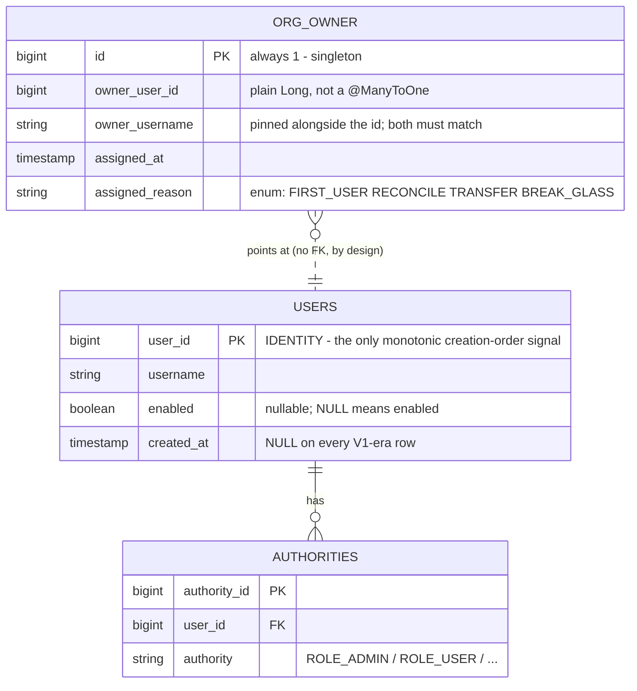

# Org Ownership - Final Implementation Plan

Background research and the full current-state evidence live in [org_ownership_research.md](org_ownership_research.md). A rendered version of this document is at [org_ownership_plan.html](org_ownership_plan.html).

## 1. TL;DR

- **Three PRs, split by flavor, not by lifecycle.** PR1 is entirely self-hosted (pointer, protection, transfer, UI). PR2 is entirely SaaS (leader resolution fix, leadership transfer). PR3 is the gate, and is self-hosted only. Each PR needs one boot and one vitest scope instead of two. The ordering rule survives: transfer ships in PR1 and PR2, the gate closes in PR3.
- **Self-hosted owner = lowest `user_id` holding `ROLE_ADMIN` and enabled,** stored in a one-row `org_owner` table pinned by **both id and username**, validated and self-healed at every boot. Stamped at first-user creation where that event exists; derived silently otherwise. No banner, no ceremony.
- **The API is split in two: `ownerId()` never writes, `resolveOwner()` is the only writer.** Both short-circuit on the `saas` profile inside the service, not just in the bootstrap bean. This is load-bearing: SaaS *does* have `ROLE_ADMIN` principals (`UserRoleWebhookController.java:55,87,120,153`, `PricingPolicyAdminController.java:54-126`, `ProcurementController.java:488,513`), and `SaasTeamController.java:354,395` calls the shared `UserService.changeRole`. A deriving read on that path would stamp a service account as owner and permanently break SaaS role management.
- **`/admin/changePasswordForUser` is the fourth refusal, and it is not optional.** `UserController.java:657` is `hasRole('ADMIN')` with only a self-check (`:676-680`), then calls `changePassword` (`:696`) and `invalidateUserSessions` (`:699`). Without a target-side guard, any second admin resets the owner's password, logs in as them, and transfers ownership. Every other protection in this plan is a two-call bypass until that lands.
- **New table, not a column on `users`.** `users` is `MIGRATION_OWNED` (`app/saas/src/main/java/stirling/software/saas/config/SaasSchemaOwnership.java`), so a new column would never exist on SaaS and every user query would break there.
- **Naming collision, found in the code, must be fixed in PR1.** `UsersDirectory.tsx:104` already labels the *admin role* as `t("users.role.orgOwner", "Org Owner")` in the role dropdown. Every admin currently reads as "Org Owner". Add `[users.role] admin = "Admin"` for the dropdown and reuse the existing `users.role.orgOwner` key for the real owner chip.
- **Placement is free.** `stirling.software.proprietary.model` is in `@EntityScan` and `stirling.software.proprietary.security.repository` is in `@EnableJpaRepositories` (`DatabaseConfig.java:29-58`, both verified). **No `DatabaseConfig` edit.**
- **Recovery is `STIRLING_ORG_OWNER_BREAK_GLASS=<username>`, read via `System.getenv()` only.** Any settings.yml-backed control is self-service for the exact population it fences out: settings.yml is `addFirst`ed above `systemEnvironment` on non-saas (`ApplicationProperties.java:104-111`), and `isValidSettingKey` allowlists only the *first* path segment against `VALID_SECTION_NAMES` (`AdminSettingsController.java:685-706, :735`) - and `security` is on that list, so `security.orgOwner.*` is admin-writable.

---

## 2. What changes, per flavor

**Self-hosted.** A new singleton table `org_owner` holds one `owner_user_id` plus `owner_username`. `OrgOwnerService.resolveOwner()` reads it, validates that the pointed-at user still exists, still carries that username, still holds `ROLE_ADMIN` and is still enabled, and otherwise re-derives and rewrites. That runs on `ApplicationReadyEvent`, after a UI database restore, and from the transfer endpoint. The owner is an extra title on top of `ROLE_ADMIN`, never a replacement, so `Role`, `Authority` and every existing `hasRole('ADMIN')` check are untouched. The owner cannot be demoted, disabled, deleted, or have their password reset by another admin; they can transfer the title; and after PR3 they are the only account that may mutate the account link.

**SaaS.** No new marker, no new rights, no `org_owner` row ever. The org owner is the `TeamRole.LEADER` of the team `users.team_id` points at. Two things change: `LeaderTeamResolver` resolves that membership instead of the oldest one, and a new leader-only endpoint transfers `LEADER` atomically. Both the stamp and the derive are hard-disabled under the `saas` profile, and a test asserts the table stays empty.

---

## 3. The three PRs

### PR 1 - Self-hosted org owner: pointer, protection, transfer, UI

**Scope.** Everything self-hosted, end to end. This PR adds refusals, so it changes behaviour from day one. Test it in one H2 boot plus one portal vitest scope.

**Backend (new)**
- `app/proprietary/src/main/java/stirling/software/proprietary/model/OrgOwner.java` - singleton entity, `@Table(name = "org_owner")`, `SINGLETON_ID = 1L` assigned `@Id` per `UserLicenseSettings.java:25-29`, `implements Persistable<Long>` with `isNew() == true`. Two-line comment pointing at `SourceDocTotalEntity.java:20-25` as the precedent; the full rationale goes in the PR body.
- `app/proprietary/src/main/java/stirling/software/proprietary/security/repository/OrgOwnerRepository.java` - sits beside `UserLicenseSettingsRepository`, already inside `@EnableJpaRepositories`. Carries the `@Modifying` update query.
- `app/proprietary/src/main/java/stirling/software/proprietary/service/OrgOwnerService.java`:
  - `ownerId()` / `isOwner(Long)` / `isCurrentUser(Authentication)` - **pure reads. Never derive, never write.** Return empty when the row is absent or invalid.
  - `resolveOwner()` - the only writer. Returns early with no write when the `saas` profile is active (the `InitialSecuritySetup.isSaas()` pattern, `:51-53`).
  - `stampIfAbsent(User, Reason)` - same saas short-circuit.
  - `isCurrentUser` resolves strictly by `authentication.getName()` then `findByUsernameIgnoreCase`, then compares by id. Never casts to `UserDetails`: `UserController.java:763-770` already has to switch over four principal shapes (`UserDetails`, `OAuth2User`, `CustomSaml2AuthenticatedPrincipal`, `String`), and an API-key or SAML admin must not 403.
- `app/proprietary/src/main/java/stirling/software/proprietary/service/OrgOwnerBootstrap.java` - `@Profile("!saas")`, `@EventListener(ApplicationReadyEvent.class)`, `@Order(3)`. Handles break-glass, then calls `resolveOwner()`.

**Backend (edit)**
- `app/saas/src/main/java/stirling/software/saas/config/SaasSchemaOwnership.java` - add `"org_owner"` to `HIBERNATE_MANAGED`. **Do this first or the build is red**; `SaasSchemaOwnershipTest` derives its scan from the two `@EntityScan` declarations and fails on any unowned entity.
- `UserRepository.java` - add:
  ```java
  @Query("SELECT u FROM User u JOIN u.authorities a WHERE a.authority = 'ROLE_ADMIN' "
       + "AND (u.enabled IS NULL OR u.enabled = true) ORDER BY u.id ASC")
  List<User> findEnabledAdminsByIdAsc();
  ```
  Order by `u.id`, never `createdAt`. The authority filter is what excludes the internal API user: `Role.INTERNAL_API_USER`'s roleId is the literal `"STIRLING-PDF-BACKEND-API-USER"` with no `ROLE_` prefix (`Role.java:32-36`), so a username exclusion is redundant. Add it as a one-line belt-and-braces with a comment saying why.
- `InitialSecuritySetup.java` - capture the discarded return of `userService.saveUserCore(...)` at `:147` and `:168` and stamp it. **Not `:188`** (internal API user). **Guard the stamp with the existing `isSaas()`**: the class is a bare `@Component` with no `@Profile` (`:30-33`) and its `if (!userService.hasUsers())` branch (`:59-65`) is *not* behind `isSaas()`, so on a fresh SaaS preview branch `createDefaultAdminUser()` runs and would otherwise write an `org_owner` row on SaaS. The stamping call must catch `Throwable` and log only: `init()` catches `IllegalArgumentException` and calls `System.exit(1)` (`:76-80`), and anything else escaping `@PostConstruct` fails context startup.
- `DatabaseService` - call `resolveOwner()` at the end of `importDatabaseFromUI` (`:261-270`), not only at boot.
- `AdminUserSummary.java` - add `private boolean orgOwner;` beside `teamLead` (`:54`) and `portalAccess` (`:59`).
- `ProprietaryUIDataController.convertUserToSummary` (`:602-628`) - populate from a per-request validating read, not a boot-cached id, so a deleted or demoted owner drops out of the roster immediately.
- `AuthController.buildUserResponse` (`:631-660`) - add `orgOwner` beside `portalAccess` (`:638`) and `teamLead` (`:639`). PR3 depends on this.

**Backend (refusals - four, all by `user_id`)**
| Refusal | Service | Controller mirror |
|---|---|---|
| Role change away from `ROLE_ADMIN` | `UserService.java:431` | `UserController.java:613` |
| Disable | `UserService.java:439` | `UserController.java:757` |
| Delete | `UserService.java:256`, in the `INTERNAL_API_USER` guard block at `:261` | `UserController.java:805`, **before** the session-expiry loop at `:807-813` |
| Password reset by a non-owner | `UserService.java:417` | `UserController.java:676-680`, **before** `changePassword` at `:696` |

All four are inert when the row is absent, which is what keeps `UserService` safe on SaaS even in the paths shared with `SaasTeamService.java:342`. Refusals throw a checked, message-carrying exception the controller maps to 400, never a bare `RuntimeException` - `deleteUser` is reachable from callers that have already invalidated sessions. `/admin/saveUser` needs no guard (create-only, 409s on an existing username). `/admin/unlockUser` (`:783`) needs none either: unlocking is not a takeover.

**Backend (transfer + break-glass)**
- `POST /admin/transferOwnership` in `UserController` - `hasRole('ADMIN')` plus caller-is-owner. **One `@Transactional` method**: promote the target to `ROLE_ADMIN` if needed, flush, re-read the authority to confirm, *then* write the pointer with reason `TRANSFER`. Refuse outright if the target cannot be promoted. If the pointer commits and the promote does not, the next `resolveOwner()` re-derives to an arbitrary third admin.
- Break-glass in `OrgOwnerBootstrap`: `System.getenv("STIRLING_ORG_OWNER_BREAK_GLASS")`, resolve the user, ensure `ROLE_ADMIN` and enabled, re-stamp with reason `BREAK_GLASS`, WARN log plus audit event. **Unknown username, blank value, and the internal API user must all WARN and continue booting.** Never throw.

**Frontend**
- `frontend/editor/src/portal/api/users.ts` - `orgOwner?: boolean` on `Member` and `AdminUserSummaryDto`, mapped in `fetchUsers`.
- `frontend/editor/src/portal/api/users.ts` - add `transferOwnership`. **Not `usersBackend.ts`**: that file's own header (`:15-18`) says self-hosted-only actions stay in `@portal/api/{users,teams}` and are gated via `usersCapabilities`, and the SaaS impl would only ever be a throw-stub like `cancelInvitation` (`:47-51`).
- `usersCapabilities.ts` x3 (`portal/api/`, `proprietary/portal/`, `saas/portal/`) - add `transferOwnership`. Five files total including the two story literals; mechanical.
- `frontend/editor/src/portal/components/users/UsersDirectory.tsx`:
  - `:104` - change the admin role option to `t("users.role.admin", "Admin")`. It currently says "Org Owner" for every admin.
  - `column.caps` block (`:211-248`) - an owner chip using the freed `t("users.role.orgOwner", "Org Owner")`, next to the `showApprover` chip at `:240-245`.
  - `rowKebab` (`:121-176`) - one new item gated on `capabilities.transferOwnership && viewerIsOwner && !m.isSelf && m.role !== "guest"`. Not a second kebab, not in the role `Select`.
- `frontend/editor/src/portal/components/users/directory.ts` - **sort** the organization group owner-first at `:29`. Do not filter it: the team loop `continue`s on `role === "admin"` at `:34`, so narrowing the group would delete every non-owner admin from the roster.
- `frontend/editor/src/portal/views/Users.tsx` - a `setConfirm({... danger: true})` block next to `removeUser`, using the existing `ConfirmModal` (`:39-45`). **No type-to-confirm component exists in this codebase and this PR does not add one.**
- `frontend/editor/src/proprietary/auth/types.ts`, `proprietary/auth/supabase/UseSession.tsx` - thread `orgOwner` through the path `portalAccess`/`teamLead` already use.
- `frontend/editor/public/locales/en-US/translation.toml` - add `[users.role] admin`, `[users.action] transferOwnership`, `[users.confirm] transferOwnershipTitle/Body`. **en-US only.** Do not touch `[users.group] owners` (see §10).

**Tests**
- `app/proprietary/src/test/java/stirling/software/proprietary/service/OrgOwnerServiceTest.java` - the boot matrix from §5, plus: disabled admin is skipped; `saas` profile leaves the table empty; break-glass with an unknown/blank/internal username warns and continues.
- `app/proprietary/src/test/java/stirling/software/proprietary/security/service/UserServiceOrgOwnerGuardTest.java` - all four refusals, inert when the row is absent, and a saas-profile case asserting `changeRole`/`changeUserEnabled`/`deleteUser` leave `org_owner` empty.
- `UsersDirectory.test.tsx`, `UsersDirectory.stories.tsx` (`orgOwner: true` on the first admin in `MEMBERS`/`STATE_MEMBERS`/`BIG_MEMBERS`, plus a `SecondAdminNotOwner` story), `portal/mocks/users.ts`, `Users.saas.test.tsx` (asserts the chip and kebab item are **absent** on SaaS).
- Existing, will need touching: `SaasSchemaOwnershipTest` (red until `org_owner` is registered), `AdminSettingsQueryPerfTest.java:160,172`.

**Test in this order.** Break-glass first, then the refusals, then transfer. Break-glass is the only recovery path from the refusals this same PR introduces.

**Testable on its own by.** Fresh boot (owner is id 1); upgraded H2 with three admins and `created_at` NULL (owner is lowest id, zero writes to `users`); delete the owner and reboot (re-resolves); try to demote/disable/delete/password-reset the owner (four readable 400s); transfer to a second admin and watch the chip move; set the env var and reboot.

**Size.** ~1100-1300 lines. It is the biggest PR, and it is one flavor, one boot, one vitest scope.

---

### PR 2 - SaaS: correct leader resolution, and let leadership move

**Scope.** SaaS only. No `org_owner`, no self-hosted file, no shared `UserService` edit.

**Backend**
- `app/saas/src/main/java/stirling/software/saas/accountlink/LeaderTeamResolver.java:51-66` - prefer the membership whose team matches `users.team_id` via `memberRepo.findByTeamIdAndUserId`, falling back to today's `findPrimaryMembership(...).getFirst()` when `users.team_id` is null or has no matching row. **Do not touch the `findPrimaryMembership` query** (`TeamMembershipRepository.java:59-63`): re-pointing it would silently move invoices, payment methods, fleet stats, legal consent and procurement signatures for every invited user in one commit. The other six call sites stay untouched.
- `SaasTeamController` - `POST /{teamId}/members/{memberId}/transfer-leadership`, `@PreAuthorize("@teamSecurity.isTeamLeader(#teamId)")`, `@Transactional`, mirroring `removeTeamMember` (`:327-368`) including the `setRollbackOnly()` + `BAD_REQUEST Map.of("error", ...)` style.
- `SaasTeamService.transferLeadership(teamId, memberId, caller)` - promote target to `LEADER` and demote caller to `MEMBER` **in one transaction**. The unique constraint is `(team_id, user_id)` only (`TeamMembership.java:27`), so a partial failure leaves two leaders. Refuse on a personal team.

**Frontend**
- `frontend/editor/src/cloud/contexts/SaaSTeamContext.tsx:244` - `transferLeadership` beside `removeMember`.
- `frontend/editor/src/cloud/components/shared/config/configSections/TeamSection.tsx:466-482` - "Make owner" above the existing "Remove from Team", gated on the `isTeamLeader && !isPersonalTeam` the context already exposes (`:263-264`).
- `frontend/editor/public/locales/en-US/translation.toml` - `[team] makeOwner` plus its confirm/success/error triple.

**Desktop is fine, verified.** `cloud/` compiles into saas and desktop (`vite.config.ts:167-170`), but `TeamSection` only mounts when `isSaasMode && isAuthenticated` (`desktop/components/shared/config/configNavSections.tsx:108-117`), and in SaaS mode the desktop client talks to the SaaS backend where the endpoint exists. No flavor gate needed beyond the leader/personal check above.

**Tests**
- `app/saas/src/test/java/stirling/software/saas/accountlink/LeaderTeamResolverTest.java` - invited MEMBER 403s; leader binds to the org team id; user with null `users.team_id` falls back unchanged.
- `app/saas/src/test/java/stirling/software/saas/service/SaasTeamServiceTransferLeadershipTest.java` - promote+demote atomic, exactly one leader after, refused on a personal team, refused for a MEMBER caller.
- `portal/mocks/handlers/teamSaas.ts`.

**Testable on its own by.** Invited member is refused approval; leader approves and the instance binds to the org team; transfer leadership and confirm the old leader loses the kebab.

**Size.** ~400-550 lines.

---

### PR 3 - The self-hosted owner-only link gate

**Scope.** Four annotations and a UI gate. Smallest diff, largest blast radius, its own release.

**Backend**
- `app/proprietary/src/main/java/stirling/software/proprietary/accountlink/AccountLinkController.java` - method-level `@PreAuthorize("hasRole('ADMIN') and @orgOwnerService.isCurrentUser(authentication)")` on exactly four methods: `connectStart` (`:59`), `connectReauth` (`:78`), `connectComplete` (`:95`), `unlink` (`:143`). **Restate `hasRole('ADMIN')` on each** - a method-level annotation *replaces* the class-level one at `:29`.
- `status` (`:138`), `usage` (`:153`) and `sync-now` (`:159`) stay on the class rule. Any admin keeps read visibility and manual sync.
- Return `{"error":"orgOwnerRequired"}` on the 403 so the UI can explain itself.

**Frontend**
- `frontend/editor/src/portal/hooks/useConnectGate.ts:44` - combine the existing `accountLinkAvailable` with the session's `orgOwner` flag PR1 added to `AuthController.buildUserResponse`, so non-owner admins never see the connect card.
- **No `ConfigController` change.** `ConfigController` is in `:core`, has zero `stirling.software.proprietary` imports, and `:core`'s `:proprietary` dependency is conditional (`app/core/build.gradle:12-15`). Its own comment at `:341-346` says exactly this. A caller-is-owner value cannot be resolved there without a new `:common` interface, which is scope this plan does not budget.

**Tests**
- `app/proprietary/src/test/java/stirling/software/proprietary/accountlink/AccountLinkControllerAuthTest.java` - **must set `stirling.billing.account-link.enabled=true` and assert the bean exists before the auth cases run.** The controller is `@ConditionalOnProperty(..., havingValue = "true")` and `@Profile("!saas")`; without the property there is no bean and the test passes vacuously, which is precisely the failure this test exists to catch. Cases: admin-but-not-owner 403s on all four methods; owner passes; a non-admin who somehow matches the pointer still 403s. Parameterise over `UsernamePasswordAuthenticationToken`, `ApiKeyAuthenticationToken`, OAuth2 and SAML principals.

**Testable on its own by.** Owner links; second admin gets 403 `orgOwnerRequired` and never sees the card; SSO admin with an API key still passes as owner.

**Rollback is revert. There is no flag.** Do not ship PR3 in the same release as PR1 - operators need the transfer endpoint live and exercised before the gate closes.

**Size.** ~150-250 lines.

---

## 4. Data model

**One row, two columns that matter, no foreign key.**



**The invariant.** At most one row, `id = 1`. `owner_user_id` names a user that exists, **still carries `owner_username`**, holds `ROLE_ADMIN`, and is **enabled**. When any of that stops being true, the next `resolveOwner()` rewrites it.

**Why the username is pinned too.** Without it, a restored pre-feature backup launders drift into a valid-looking pointer. `exportDatabase` emits `SCRIPT SIMPLE COLUMNS DROP` (`DatabaseService.java:294`) and `importDatabaseFromUI` (`:261-270`) RUNSCRIPTs it. A pre-feature dump drops and recreates `USERS` with its own explicit identity values but never names `ORG_OWNER`, so the stale pointer survives. Id N now resolves to a different human; if they are any admin, an id-only check passes and hands them ownership silently. Both-must-match plus a post-import `resolveOwner()` closes it.

**Why `enabled` is in the check.** `User.enabled` is a boxed `Boolean` where null means enabled (`User.java:51-53, :118`). A disabled admin satisfies exists-and-is-admin forever and never self-heals, so ownership freezes on a dead account. The disable refusal prevents this prospectively; the validity check is what recovers from it.

**Why a new table, not a column on `users`.** `users` is `MIGRATION_OWNED`; its migrations live in a separate Supabase repo, and `MigrationOwnedSchemaFilter` hides it from Hibernate DDL but not DML. A new `User` field would compile and then fail every user query on SaaS. Second reason: a restore's `CREATE TABLE USERS` predates the column and would silently erase it.

**Why no FK.** A real FK turns an attempted owner delete into a raw constraint violation surfacing as a 500 from deep inside `deleteUser`'s flush, and `deleteUserRelatedData` (`:272-300`) does not enumerate it. The service refusal is the fence.

**Why `Persistable` with `isNew() == true`.** Spring Data's `save()` on an assigned non-null `@Id` is `merge()`, a silent UPDATE. Precedent: `SourceDocTotalEntity.java:20-25, :54-58`. Consequences: the first stamp is `saveAndFlush` inside its own `TransactionTemplate` catching `DataIntegrityViolationException` (the `FileEncryptionKeyService.java:327-343` shape, needed because `@PostConstruct` has no ambient transaction), and **every subsequent write is an explicit `@Modifying` UPDATE, never `save()`.**

---

## 5. First-user stamping and existing installs

**Read this before writing code.**

### The exact rule (`OrgOwnerService.resolveOwner()`)

0. If the `saas` profile is active, return immediately. No read, no write.
1. Read the row `id = 1`. If `owner_user_id` is set, that user exists, **their username still equals `owner_username`**, they hold `ROLE_ADMIN`, and they are **enabled** - that is the owner. Done. No write.
2. Otherwise the owner is the lowest-id enabled `ROLE_ADMIN`, **preferring one whose `firstLogin` is not true** and falling back to the lowest-id enabled admin overall. Write the row (insert if absent, `@Modifying` UPDATE if invalid). Log at INFO with the username; WARN when it replaced a dangling or drifted pointer.
3. No admin at all: no owner. Owner-gated endpoints 403. That is what `hasRole('ADMIN')` already produces, so nothing regresses. **Do not add an "owner unset means any admin" fallback** - that reopens the gate on every login-enabled install.

`ownerId()` / `isOwner()` / `isCurrentUser()` execute step 1 only. **They never derive and never write.** `resolveOwner()` is called from exactly three places: the `@Profile("!saas")` bootstrap, the end of `importDatabaseFromUI`, and `/admin/transferOwnership`. Step 1's single primary-key lookup is the idempotence guard, so no `CompletedMigrations` marker is needed, and unlike a completion marker it keeps working after a runtime restore.

Zero-owner recovery: if an install reaches zero admins and one is created later, `saveUserCore` stamps when no valid owner exists, on `!saas` only. No other write path derives.

### Where the instruction had to be interpreted

*Stamped at first-user creation, no elected-on-upgrade ceremony.* Both halves are honoured, but the first is not sufficient on its own.

For installs that already exist there is **no first-user-creation event left to hook**. Worse, `saveUserCore` calls `exportDatabase()` on every user creation (`UserService.java:570`), so essentially every install that ever made a user has a backup on disk, and `InitialSecuritySetup.init` takes `importDatabase()` **instead of** `initializeAdminUser()` when one exists (`:59-65`). Even a wiped database directory with an intact backup folder never reaches the creation path.

**So "stamp at first-user creation" becomes "stamp at first-user creation where that event exists, and derive silently otherwise".** Not an election: nobody chooses, nothing is offered, no banner, no claim. It is a deterministic reconstruction from data that already exists.

**The creation stamp is the nicety. The boot reconcile is the mechanism.** Both `InitialSecuritySetup` stamp sites are reachable only when `!hasUsers()` *and* `!hasBackup()`, which is a minority of installs. Say that in the PR description or a reviewer will assume the stamp is sufficient.

### `created_at` is unusable - do not reach for it

It did not exist in V1; it arrived with `848ff9688b`. With `ddl-auto=update` a V1 upgrade adds it nullable, and `@CreationTimestamp @Column(updatable = false)` (`User.java:104-106`) only writes on INSERT. **Every V1-era row carries `created_at = NULL` permanently.** `user_id` is `@GeneratedValue(IDENTITY)`, monotonic within a database lineage, and survives backup/restore verbatim.

(This concern is specific to `users`. `TeamMembership.createdAt` is `@CreationTimestamp @Column(nullable = false)` (`:77-79`), so §6's ordering is deterministic - that bug is "oldest membership is the parked personal team", not a NULL-ordering hazard.)

### Lockout vectors - exhaustive

| # | Vector | Outcome | Mitigation |
|---|---|---|---|
| 1 | Owner deleted or demoted | Pointer dangles | Step 1 re-derives; PR1's refusals prevent it prospectively. |
| 2 | Owner disabled or brute-force locked | Ownership freezes on a dead account | `enabled` is in step 1; disable refusal ships in PR1. A locked sole owner is recoverable only via break-glass. Say so in the runbook. |
| 3 | Historical first admin deleted years ago | Ownership lands on the oldest *surviving* admin | **Accepted, unrecoverable without `created_at`.** Log at INFO with the username so an operator can transfer. |
| 4 | No `ROLE_ADMIN` at all | No owner; link endpoints 403 | Not a regression. Do not fail open. |
| 5 | `security.enableLogin=false` | No authenticated principal | `UserAuthenticationFilter` chains through without an Authentication while `@EnableMethodSecurity` stays on, so account-link is **already** unreachable there today. Pointer still written (free); nothing reads it. **Do not fail open.** |
| 6 | **Derived owner is the dormant `admin`/`stirling` account** | Billing control concentrated on the weakest credential on the box | `createDefaultAdminUser` (`:154-171`) creates `admin`/`stirling` with `firstLogin(true)` before any human, whenever `initialLogin` is not fully configured. Step 2 prefers a non-`firstLogin` admin; when it cannot, WARN naming the account and surface a portal notice. **PR1 must ship transfer, and an operator must demonstrate a successful transfer on such an install, before PR3 gates anything.** |
| 7 | **SSO migration strands the bootstrap admin** | Owner cannot log in | `CustomOAuth2AuthenticationSuccessHandler:119-126` bounces an existing password-holding non-SSO user to `/logout` when `autoCreateUser` is on. Break-glass (§7) is the answer. |
| 8 | Old backup restored via the UI | Pointer may dangle or drift | Username pinning plus a post-import `resolveOwner()`. Known limitation: a crafted backup carrying its own `org_owner` row is an unguarded transfer path, but an admin who can restore a database already owns the box. |
| 9 | Multi-node concurrent first boot | Duplicate singleton insert | `saveAndFlush` in its own `TransactionTemplate`, catch `DataIntegrityViolationException`, re-read the winner, treat as success. |
| 10 | Stamping throws | **JVM exits** | `init()` catches `IllegalArgumentException` and calls `System.exit(1)` (`:76-80`). The stamping and break-glass calls must catch everything and log only. |

---

## 6. The two-way link gate

**Self-host org owner starts and completes the link; SaaS team leader approves it.** Neither end is enforced today.

```mermaid
sequenceDiagram
    autonumber
    actor SH as Self-host org owner<br/>(ROLE_ADMIN + org_owner)
    participant I as Instance<br/>/api/v1/account-link
    participant B as Browser
    participant S as SaaS /connect
    actor SO as SaaS team leader<br/>(LEADER of users.team_id)

    SH->>I: POST /connect/start
    Note over I: hasRole('ADMIN') AND<br/>@orgOwnerService.isCurrentUser(auth)
    I--xSH: 403 orgOwnerRequired if merely an admin
    I-->>B: handoff URL + state
    B->>S: GET /connect?state=...
    SO->>S: POST /connect/{id}/approve
    Note over S: LeaderTeamResolver.resolve()<br/>membership matching users.team_id,<br/>role must be LEADER
    S--xSO: 403 if MEMBER (today: wrongly passes)
    S->>S: request.setTeamId(orgTeamId); mint()
    S-->>B: redirect with code
    B->>I: POST /connect/complete
    Note over I: same owner conjunct restated
    I->>I: credentialStore.save(deviceId, secret, orgTeamId)
```

### The personal-team problem: PR2 narrows it, it does not close it

`LeaderTeamResolver` resolves via `findPrimaryMembership(...).getFirst()` (`:57-58`), which is `ORDER BY tm.createdAt ASC` - the **oldest** membership. `SaasTeamService.acceptInvitation` deliberately parks the personal team on join (`:398-405`), and `createPersonalTeam` made the user LEADER of it (`:137`) while the org membership it creates is `MEMBER` (`:439`). **Every invited SaaS user passes the leader check today, on a team of one.** The SaaS-side rule is effectively "any authenticated SaaS user".

What that costs: the approver's team is written onto the handshake (`ConnectRequestService.java:236`) and into the registered instance (`:305`), and every money decision keys off it - `/entitlement`, `ingest`, `billingService.forTeam`. An employee can bind the company's fleet to their one-seat personal wallet, which then caps and DEGRADEs the company's server, while the real leader's linked-instances list never shows it.

**Be precise about what PR2 fixes.** After it, the test is "LEADER of the team `users.team_id` points at". `createPersonalTeam` makes every user LEADER of their own personal team and points `users.team_id` at it, and `returnUserToHome` (`SaasTeamService.java:190`, called from `:503, :590, :808`) re-points a removed user back there with a LEADER membership. So an ex-employee, or anyone who never accepted an invite, can still bind a fleet to a one-seat personal wallet. **PR2 closes the hole for current org members and narrows it to solo/ex-member accounts.** Refusing personal teams outright would break legitimate solo customers, so it is not done here. See §11.

Founders are unaffected either way: on SaaS the only `new Team()` is `createPersonalTeam` (`:124`) and org teams are personal teams converted in place (`:240-247`), so a founder has exactly one membership and old and new resolution return the identical row.

---

## 7. Owner protection

**Four service-layer refusals are the fence; the controller mirrors exist for message quality.** All compare by `user_id`, never username (`changeUsername` at `:407` does not touch the pointer). All are inert when the row is absent. The table is in §3, PR1.

The fourth one is the important one. Without a target-side guard on `/admin/changePasswordForUser`, ownership is a two-call bypass and every other control in this plan is decorative. It also gives a rogue admin an unlimited session-denial weapon against the owner via `invalidateUserSessions`.

**Break-glass: `STIRLING_ORG_OWNER_BREAK_GLASS=<username>`, read with `System.getenv()` directly. Never through `ApplicationProperties`, `@Value` or `Environment`.**

`AdminSettingsController.updateSettingValue` (`:466-490`) lets any `ROLE_ADMIN` write any dotted key whose first segment is in `VALID_SECTION_NAMES` (`:685-706, :735`), and `security` is on that list. `POST /restart` sits beside it at `:530`. And on self-hosted, settings.yml is `addFirst`ed **above** `systemEnvironment` (`ApplicationProperties.java:104-111`). So a property-backed break-glass is self-service for exactly the population it fences out, and settings.yml would even beat the operator's env var. **Do not add a break-glass key to `settings.yml.template`.**

On boot with the var set: resolve the user, ensure `ROLE_ADMIN` and enabled, re-stamp with reason `BREAK_GLASS`, WARN plus audit event. Unknown, blank, or internal-API-user values WARN and boot normally. Setting it requires the compose file or systemd unit, which is genuinely out-of-band.

---

## 8. Transfer flow

**Self-hosted (PR1).** Owner opens the Users page, uses the per-member kebab on another admin, confirms in the existing danger `ConfirmModal`. `POST /admin/transferOwnership` runs one transaction: promote to `ROLE_ADMIN` if needed, flush, re-read to confirm, write the pointer with reason `TRANSFER`. The old owner keeps `ROLE_ADMIN` and immediately becomes demotable, disable-able and deletable again. One owner at all times, because the pointer is a single column.

**SaaS (PR2).** Team leader opens Settings, Account, Team, uses the member kebab, confirms. `POST /api/v1/teams/{teamId}/members/{memberId}/transfer-leadership` sets the target `LEADER` and the caller `MEMBER` in one transaction. Refused on a personal team. `team_memberships` is `MIGRATION_OWNED`, so this is a pure data change on the existing `role` column: **no schema edit, no Supabase migration.**

---

## 9. Tests and commands

**New test files**

- `app/proprietary/src/test/java/stirling/software/proprietary/service/OrgOwnerServiceTest.java` (PR1)
- `app/proprietary/src/test/java/stirling/software/proprietary/security/service/UserServiceOrgOwnerGuardTest.java` (PR1)
- `app/saas/src/test/java/stirling/software/saas/accountlink/LeaderTeamResolverTest.java` (PR2)
- `app/saas/src/test/java/stirling/software/saas/service/SaasTeamServiceTransferLeadershipTest.java` (PR2)
- `app/proprietary/src/test/java/stirling/software/proprietary/accountlink/AccountLinkControllerAuthTest.java` (PR3)

**Existing, will need touching:** `SaasSchemaOwnershipTest` (PR1), `AdminSettingsQueryPerfTest.java:160,172` (PR1), `UsersDirectory.test.tsx` / `.stories.tsx` / `portal/mocks/users.ts` / `Users.saas.test.tsx` (PR1), `portal/mocks/handlers/teamSaas.ts` (PR2).

**Commands (PowerShell, from the repo root)**

```powershell
# Backend - proprietary only (fast loop)
cmd /c ".\gradlew.bat :proprietary:test --tests '*OrgOwner*' --tests '*AccountLinkControllerAuth*'"

# Backend - SaaS module must be put in the graph explicitly
$env:STIRLING_FLAVOR = "saas"
cmd /c ".\gradlew.bat :saas:test --tests '*SaasSchemaOwnership*' --tests '*LeaderTeamResolver*' --tests '*TransferLeadership*'"
Remove-Item Env:\STIRLING_FLAVOR

# Frontend - scoped
npx vitest run --root frontend/editor src/portal/components/users
npx vitest run --root frontend/editor src/portal/views/Users

# Storybook stories (separate vitest project; port 63315 has bitten this repo before)
npx vitest run --config frontend/.storybook/vitest.config.ts

# i18n gate - --branch is required=True, the command fails on argparse without it
python .github/scripts/check_language_toml.py `
  --reference-file frontend/editor/public/locales/en-US/translation.toml --branch main

# Before pushing, per house rules
task fix
task check
```

**Manual boot matrix for PR1** (five boots, no UI needed):

1. Fresh H2, no backup folder: owner is id 1, reason `FIRST_USER`.
2. Upgraded H2, three admins, `created_at` NULL: owner is the lowest-id non-`firstLogin` admin, reason `RECONCILE`, zero writes to `users`.
3. Empty DB with an intact backup folder: takes the `importDatabase` branch, reconcile still stamps.
4. Delete the owner, reboot: re-resolves to the next-lowest enabled admin.
5. Disable the owner directly in H2, reboot: re-resolves (proves the `enabled` check).

Plus one saas-profile boot asserting `org_owner` is empty, and one restore of a pre-feature dump whose id-2 row is a different username, asserting a re-derive.

---

## 10. Deliberately NOT in this plan

Do not re-add any of these.

- **Narrowing PORTAL / processor access to the org owner.**
- **Narrowing SERVER-scope resource ownership to the org owner.**
- **`security.orgOwner.adminBypassesOwnership`** or any staged flag.
- **Rerouting the seven `findPrimaryMembership` call sites.** The fix stays inside `LeaderTeamResolver`.
- **Any claim banner or "any admin may claim" ceremony.**
- **A one-time bulk backfill.** It writes once and is then blind.
- **A column on `users`**, and any Supabase migration in the separate repo.
- **A break-glass settings.yml key**, or any property-backed org-owner control.
- **A type-to-confirm component.** `ConfirmModal` with `danger` is the house pattern.
- **Narrowing `directory.ts`'s organization group.** Sort and chip only.
- **A general last-admin guard** on `/admin/changeRole`.
- **New rights for SaaS org owners.** Only transfer is new.
- **`ConfigController.accountLinkOwnerOnly`.** `:core` cannot reach `:proprietary`; the session's `orgOwner` flag does the job.
- **`ConnectController.deny` switching to `resolveMember`**, the team name on `ConnectView`, and the `ConnectApprove` / `ConnectApproveView` copy change. All three are UX niceties on the highest-blast-radius PR. File as follow-ups.
- **The `[users.group] owners = "{{count}} owner"` pluralisation fix.** Pre-existing breakage, unrelated, its own one-line locale PR.
- **`transferOwnership` on the `UsersBackend` interface.** It goes in `@portal/api/users.ts` per that file's own convention.

---

## 11. Open decisions

1. **SaaS transfer produces exactly one LEADER.** The unique constraint is `(team_id, user_id)` only, so co-leaders are physically possible. My call: atomic promote-then-demote, single leader. Confirm, or the endpoint becomes a pure promote.
2. **Solo and ex-member SaaS accounts can still bind a fleet to a personal wallet after PR2.** Closing it means refusing personal teams outright, which breaks legitimate solo customers. My call: narrow, do not close, and say so in the PR body. Confirm.
3. **Existing SaaS instances already bound to personal teams get force-relinked, not migrated.** There is no admin path to re-point a `LinkedInstance`. Before PR3, query `LinkedInstance` rows whose `teamId` points at an `isPersonal` team; those are already billing the wrong wallet. My call: they break on the next reauth and re-link. Confirm, or a one-off re-point script goes in PR2.
4. **`ProcurementController.requireLeader` (`:566-575`) carries the identical personal-team hole** and lets an invited member act commercially bound to their personal team. My call: file separately rather than widen PR2. Confirm, or fold it in.
5. **Should the owner's API key be able to unlink billing?** `isCurrentUser` resolves by `authentication.getName()`, so an `ApiKeyAuthenticationToken` for the owner passes. My call: yes, allow it - the alternative silently breaks headless operators. Confirm.