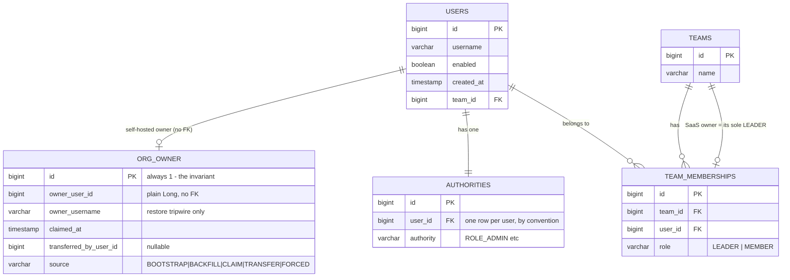

# Org ownership: background research

**Status: superseded on scope. Build from [org_ownership_plan.md](org_ownership_plan.md) instead.**

This is the first-pass analysis. Its current-state research and bug evidence still hold, but it predates four decisions that shrank the work from seven PRs to three: the org owner is stamped at first-user creation rather than elected on upgrade, a self-hosted org owner is always also an admin, a SaaS org owner is the existing team lead and gains no new rights, and the processor / SERVER-scope narrowing is dropped entirely. Read it for the "how ownership works today" evidence, not for the plan.

---

## 1. TL;DR

- Org ownership becomes a **stored fact on self-hosted**: one row in a new Hibernate-managed `org_owner` table, read through one interface and one `@PreAuthorize` bean, `@orgOwner`. Ownership is **deployment-scoped**, so on SaaS the interface deliberately answers "no owner" and the SaaS concept stays where it already lives: the team's sole `TeamRole.LEADER`, addressed by the existing `@teamSecurity.isTeamLeader(#teamId)`.
- **The decision that matters:** ownership is a *pointer*, deliberately orthogonal to `Role` and to `TeamRole`. Not a new `Role` constant (that breaks `AuthorityRepository.findByUserId(long)`, which returns a single `Authority` at [`AuthorityRepository.java`](app/proprietary/src/main/java/stirling/software/proprietary/security/database/repository/AuthorityRepository.java):15); not a column on `users` (migration-owned on SaaS, fails silently there); and not a `LEADER` row on the Default team ([`TeamMembershipService.syncMembership`](app/proprietary/src/main/java/stirling/software/proprietary/security/service/TeamMembershipService.java):39-55 destructively rewrites that table from five call sites, with no error and no audit).
- `ROLE_ADMIN` is untouched. All 59 non-test `hasRole('ADMIN')` gates keep working on upgrade day. Org owner is an *additional* single-holder marker on top of admin, so a wrong upgrade election is embarrassing, not disabling.
- **Processor and SERVER-scope ownership are fixed by derivation, not by writing owner columns.** `PORTAL` gets a policy-aware disjunct; `SERVER` scope resolves its owner through the pointer. Both avoid the `matchesTeamLeadDefault` regression that either naive fix causes ([`ResourceAccessService.java`](app/proprietary/src/main/java/stirling/software/proprietary/access/service/ResourceAccessService.java):224-233), and neither needs a data backfill or a per-transfer sweep.
- **On SaaS, the transfer is only half a transfer until the primary-membership split is closed.** Seven controllers gate on the caller's *oldest* membership, which for every invited colleague is their retained personal team. Fixing that is a blocking prerequisite inside the SaaS PR, not a deferral.
- Ships in 7 ordered PRs. Nothing in PR 1 changes any existing authorization decision.

---

## 2. How ownership works today

### Side by side

| | Self-hosted | SaaS |
|---|---|---|
| Is there an org entity? | No | No, the org **is** the `Team` row |
| Who "owns" it? | Every `ROLE_ADMIN`, co-equally | Whoever holds `TeamRole.LEADER` on the team |
| Where is that stored? | Nowhere. Inferred from an authority string | `team_memberships.role` |
| How many can there be? | Unbounded | Unbounded (only constraint is `UNIQUE(team_id, user_id)`) |
| Can it be transferred? | No | No |
| Who is the founder? | Not recorded | The personal-team creator, implicitly |

### Self-hosted: ownership is an authority-string scan, duplicated

There is no owner column, owner row, or owner marker on any table. Every "does this person own the org" question is answered by the same three-line scan, written out four times:

- [`OwnershipService.java`](app/proprietary/src/main/java/stirling/software/proprietary/access/service/OwnershipService.java):99-102 - `user.getAuthorities().stream().anyMatch(a -> Role.ADMIN.getRoleId().equals(a.getAuthority()))`
- [`ResourceAccessService.java`](app/proprietary/src/main/java/stirling/software/proprietary/access/service/ResourceAccessService.java):246-249 - byte-identical copy
- [`PortalAuditScopeResolver.java`](app/proprietary/src/main/java/stirling/software/proprietary/audit/PortalAuditScopeResolver.java):16 - a bare `"ROLE_ADMIN"` string literal
- `UserService.isCurrentUserAdmin` at [`UserService.java`](app/proprietary/src/main/java/stirling/software/proprietary/security/service/UserService.java):730

The frontend mirrors it at [`users.ts`](frontend/editor/src/portal/api/users.ts):245 - `if (role.includes("ROLE_ADMIN")) return "admin";` - and then *names the bug*: [`directory.ts`](frontend/editor/src/portal/components/users/directory.ts):29 defines the Organization owners group as `members.filter((m) => m.role === "admin")`, and [`UsersDirectory.tsx`](frontend/editor/src/portal/components/users/UsersDirectory.tsx):104 labels the `ROLE_ADMIN` option `t("users.role.orgOwner", "Org Owner")`. On a five-admin install the roster renders "Organization - 5 owner".

### The founding account is recorded nowhere

[`InitialSecuritySetup.java`](app/proprietary/src/main/java/stirling/software/proprietary/security/InitialSecuritySetup.java):139-147 creates the first account with `.team(team).role(Role.ADMIN.getRoleId()).firstLogin(false).bypassUserLimit(true)` and nothing else; :160-168 hardcodes `admin`/`stirling` identically. `User.id` and `User.createdAt` exist ([`User.java`](app/proprietary/src/main/java/stirling/software/proprietary/security/model/User.java):104-106, `@CreationTimestamp @Column(name = "created_at", updatable = false) LocalDateTime`) but no repository query anywhere orders by either. Worse, :60-66 prefers a backup restore over the bootstrap entirely:

```java
if (!userService.hasUsers()) {
    if (databaseService.hasBackup()) { databaseService.importDatabase(); }
    else { initializeAdminUser(); }
}
```

On every existing install `hasUsers()` is already true, so this never runs at all.

### There is no last-admin invariant

The only guard on [`UserController.java`](app/proprietary/src/main/java/stirling/software/proprietary/security/controller/api/UserController.java):611-613 is a string compare of the caller's own username - `"Cannot change your own role."` - and then :653 calls `userService.changeRole(user, role)`, which at [`UserService.java`](app/proprietary/src/main/java/stirling/software/proprietary/security/service/UserService.java):431-437 does `findRole -> setAuthority -> save` with zero validation. `deleteUser` (:256-263) refuses only `INTERNAL_API_USER`. Two admins can each demote, disable, or delete the other. Grepping `last admin|lastAdmin|adminCount|countAdmins` across `app/*/src/main/java` returns nothing.

### Concrete bug 1: the Processor has no owner, so processor ownership cannot be expressed

[`ResourceAccessService.java`](app/proprietary/src/main/java/stirling/software/proprietary/access/service/ResourceAccessService.java):42-44 is literally:

```java
public boolean canAccessPortal(User user) {
    return canUseResource(ResourceType.PORTAL, "", null, portalDefaultPolicy, user);
}
```

That hardcoded `null` owner makes `isOwner(owner, user)` return false immediately (:236-239), so step one of the four-step ladder (owner -> admin -> grant -> default policy) is **structurally dead for the portal**. Step two, `isAdmin(user)` at :102, is the only "ownership" the Processor has. Self-hosted Processor access is therefore `{every ROLE_ADMIN}` plus `{leaders of their own active team}` plus `{grant holders}`, and an admin's access is not removable in the UI - [`UsersDirectory.tsx`](frontend/editor/src/portal/components/users/UsersDirectory.tsx):219-223 only attaches `onRemove` in the `access === "granted"` branch, while [`Users.tsx`](frontend/editor/src/portal/views/Users.tsx):131 hardcodes `else if (m.role === "admin") portalAccess = "admin";` with no grant id.

No `.yml` or `.properties` in the repo sets `security.portal.defaultAccess` (verified by grep), so the `@Value` default `ADMINS_AND_TEAM_LEADS` at :36 is live on every install.

### Concrete bug 2: SERVER-scoped resources are permanently owner-less

[`OwnershipService.java`](app/proprietary/src/main/java/stirling/software/proprietary/access/service/OwnershipService.java):72-76:

```java
case SERVER -> {
    if (!isAdmin(user)) {
        throw forbidden("Only administrators can create server-owned resources");
    }
}
```

It sets neither `ownerUser` nor `ownerTeam`, so [`OwnedResource.getOwnerRef()`](app/proprietary/src/main/java/stirling/software/proprietary/access/model/OwnedResource.java):59-67 returns `null` forever. The org's S3/SMB/API credentials have no owner. Combined with the `isAdmin` short-circuits at :34 and :48, a locked server integration set up by the founding admin can be unlocked, repointed and deleted by any admin added later. The blast radius is concrete: [`EmbeddedS3CredentialMigration.java`](app/proprietary/src/main/java/stirling/software/proprietary/policy/s3/EmbeddedS3CredentialMigration.java):134 stamps `OwnerScope.SERVER` on every S3 credential lifted out of embedded config, and [`IntegrationConfigService.java`](app/proprietary/src/main/java/stirling/software/proprietary/integration/service/IntegrationConfigService.java):202 and :269 enumerate `findByScope(OwnerScope.SERVER)`.

### Concrete bug 3: account linking authorizes its two ends with two non-corresponding models

- **Self-hosted:** [`AccountLinkController.java`](app/proprietary/src/main/java/stirling/software/proprietary/accountlink/AccountLinkController.java):29 is a single **class-level** `@PreAuthorize("hasRole('ADMIN')")`, covering `/connect/start` (:59), `/connect/reauth` (:78), `/connect/complete` (:95), `/status` (:138), `/unlink` (:143), `/usage` (:153), `/sync-now` (:159). Any admin can rebind, or unbind, the whole instance's billing identity. The surface is additionally `@Profile("!saas")` (:28) and `@ConditionalOnProperty(name = "stirling.billing.account-link.enabled", havingValue = "true")` (:30).
- **SaaS:** [`LeaderTeamResolver.java`](app/saas/src/main/java/stirling/software/saas/accountlink/LeaderTeamResolver.java):58-64 requires `membership.getRole() != TeamRole.LEADER` to fail, over `memberRepo.findPrimaryMembership(user.getId())` - the caller's **oldest** membership row by `createdAt` ([`TeamMembershipRepository.java`](app/proprietary/src/main/java/stirling/software/proprietary/security/repository/TeamMembershipRepository.java):59-63), which is not necessarily `users.team_id`, which is what the charge path bills against ([`PaygChargeInterceptor.java`](app/saas/src/main/java/stirling/software/saas/payg/filter/PaygChargeInterceptor.java):302, [`EntitlementGuard.java`](app/saas/src/main/java/stirling/software/saas/payg/entitlement/EntitlementGuard.java):249 and :264).

There is no shared predicate that could express "the same person owns both sides".

### Concrete bug 4: SaaS promises a transfer it does not ship

Three user-visible errors instruct users to transfer leadership: [`SaasTeamService.java`](app/saas/src/main/java/stirling/software/saas/service/SaasTeamService.java):487 `"Cannot remove the last team leader. Transfer leadership first."`, :555 `"...or transfer leadership before joining another team."`, :580 `"Cannot leave as the last team leader. Transfer leadership first."`. [`SaasTeamController.java`](app/saas/src/main/java/stirling/software/saas/controller/SaasTeamController.java) exposes fourteen mappings and **none** mutates a membership role. `LEADER` is written in exactly three places: `createPersonalTeam` (:137), `returnUserToHome` (:201), and never on invitation accept (:439 writes `MEMBER`).

And the one ownership-transfer API that exists returns 200 while doing nothing on SaaS: [`TeamController.java`](app/proprietary/src/main/java/stirling/software/proprietary/security/controller/api/TeamController.java):165-166 returns `"Team owner assigned successfully"` unconditionally, but [`TeamMembershipService.java`](app/proprietary/src/main/java/stirling/software/proprietary/security/service/TeamMembershipService.java):60-62 and :76-78 both open with `if (isSaas()) { return; }`. It also 400s on `Default` and `Internal` by *name* at [`TeamController.java`](app/proprietary/src/main/java/stirling/software/proprietary/security/controller/api/TeamController.java):145-150, so the bootstrap admin (placed in `Default` at [`InitialSecuritySetup.java`](app/proprietary/src/main/java/stirling/software/proprietary/security/InitialSecuritySetup.java):138) can never be its subject.

### Concrete bug 5: the SaaS management surfaces are anchored to the wrong team

`acceptInvitation` deliberately **keeps** the invitee's home-team membership ([`SaasTeamService.java`](app/saas/src/main/java/stirling/software/saas/service/SaasTeamService.java):399-411: "Establish/park the durable home team: joining never deletes it"), while pointing `users.team_id` at the joined team (:429). Because `findPrimaryMembership` orders `createdAt ASC`, the invitee's *primary* membership stays their personal team forever. Seven controllers resolve "which team am I acting for" that way:

| Call site | Line |
|---|---|
| `LeaderTeamResolver.resolve` | [`LeaderTeamResolver.java`](app/saas/src/main/java/stirling/software/saas/accountlink/LeaderTeamResolver.java):58 |
| `LegalController` | [`LegalController.java`](app/saas/src/main/java/stirling/software/saas/legal/LegalController.java):115 |
| `PaygInvoicesController` | [`PaygInvoicesController.java`](app/saas/src/main/java/stirling/software/saas/payg/api/PaygInvoicesController.java):104 |
| `PaygPaymentMethodController` | [`PaygPaymentMethodController.java`](app/saas/src/main/java/stirling/software/saas/payg/api/PaygPaymentMethodController.java):84 |
| `PaygWalletController.primaryMembership` | [`PaygWalletController.java`](app/saas/src/main/java/stirling/software/saas/payg/api/PaygWalletController.java):413-416 (the `/cap` LEADER gate is at :344-347) |
| `ProcurementController` | [`ProcurementController.java`](app/saas/src/main/java/stirling/software/saas/procurement/api/ProcurementController.java):566 |
| `SaasFleetUsageController` | [`SaasFleetUsageController.java`](app/saas/src/main/java/stirling/software/saas/usage/SaasFleetUsageController.java):70 |

Meanwhile the charge path bills `user.getTeam().getId()`. Promoting a colleague to `LEADER` of the shared team therefore does **not** hand them the wallet, spend cap, invoices, payment method, procurement, fleet usage or instance binding, because those seven still resolve to their personal team. This is section 5's blocking prerequisite.

---

## 3. The model we're moving to

### Data model

One new entity, in `:proprietary`, and **zero columns added to any existing table**.

`app/proprietary/src/main/java/stirling/software/proprietary/access/model/OrgOwner.java`:

```java
@Entity
@Table(name = "org_owner")
@NoArgsConstructor @Getter @Setter
public class OrgOwner implements Persistable<Long>, Serializable {

    @Serial private static final long serialVersionUID = 1L;

    /** One deployment, one org: the primary key IS the "exactly one owner" invariant. */
    public static final Long SINGLETON_ID = 1L;

    @Id @Column(name = "id")
    private Long id = SINGLETON_ID;

    /** Plain Long, deliberately NOT @ManyToOne User - a user delete must not FK-fail. */
    @Column(name = "owner_user_id", nullable = false)
    private Long ownerUserId;

    /** Restore tripwire only. Never used for authorization; the id is authoritative. */
    @Column(name = "owner_username", length = 255)
    private String ownerUsername;

    @Column(name = "claimed_at", nullable = false)
    private LocalDateTime claimedAt;

    /** Actor of the last transfer; null for BOOTSTRAP / BACKFILL / FORCED. */
    @Column(name = "transferred_by_user_id")
    private Long transferredByUserId;

    /** BOOTSTRAP | BACKFILL | CLAIM | TRANSFER | FORCED. Diagnostic and UI copy. */
    @Column(name = "source", nullable = false, length = 16)
    private String source;

    /** Forces em.persist so a concurrent first insert raises a real PK violation. */
    @Override public boolean isNew() { return claimedAt == null; }
    @Override public Long getId() { return id; }
}
```

The singleton-row shape is copied from [`UserLicenseSettings.java`](app/proprietary/src/main/java/stirling/software/proprietary/model/UserLicenseSettings.java):25-29 (`public static final Long SINGLETON_ID = 1L;` plus an assigned `@Id @Column(name = "id")`), which is already registered in `HIBERNATE_MANAGED` at [`SaasSchemaOwnership.java`](app/saas/src/main/java/stirling/software/saas/config/SaasSchemaOwnership.java):108 and therefore already proven to be created by `ddl-auto` on both flavours.

**`Persistable` is load-bearing and is the correction to the obvious design.** With a plain assigned `@Id`, `SimpleJpaRepository.save` evaluates `isNew() == false` and calls `em.merge()`, which is a SELECT-then-UPDATE: it silently overwrites an existing owner and never throws `DataIntegrityViolationException`. [`JpaCompletedMigrations.markDone`](app/proprietary/src/main/java/stirling/software/proprietary/policy/migration/JpaCompletedMigrations.java):30-37 appears to prove the catch-the-violation idiom, but [`CompletedMigration.java`](app/proprietary/src/main/java/stirling/software/proprietary/policy/migration/CompletedMigration.java):29-31 has the same assigned-id shape and gets away with it only because its write is idempotent. Ownership is not. `isNew()` keyed on `claimedAt == null` forces `em.persist`, so the concurrent-first-boot race produces a genuine PK violation and the loser loses.

`owner_user_id` is a plain `Long`, not an FK. `deleteUserRelatedData` at [`UserService.java`](app/proprietary/src/main/java/stirling/software/proprietary/security/service/UserService.java):272-285 knows nothing about this table, and an FK would turn an unrelated user delete into a constraint violation. A dangling pointer is an explicitly modelled state (below). `owner_username` exists **only** so a boot-time check can notice that a database restore repointed the id at a different human (section 4.6); nothing authorizes on it.

`claimedAt` is `LocalDateTime` with an explicit set (not `@CreationTimestamp`, because a transfer rewrites it), matching [`ResourceGrant.java`](app/proprietary/src/main/java/stirling/software/proprietary/access/model/ResourceGrant.java):83-85 and [`User.java`](app/proprietary/src/main/java/stirling/software/proprietary/security/model/User.java):104-106. The election orders by `User.createdAt`, also `LocalDateTime`; mixing in `Instant` would put two temporal types in one comparison across H2 and Postgres for no gain.



### The invariant

**"Exactly one org owner" is enforced by the primary key**, not by a filtered index. That is the entire reason for the singleton-row shape: `@Table`/`@UniqueConstraint` cannot emit `CREATE UNIQUE INDEX ... WHERE is_org_owner` under `ddl-auto`, but `id = 1` needs no index at all. One row, one `owner_user_id` column, therefore one owner, structurally.

Four states, all representable and all handled by every read:

| State | Condition | Behaviour |
|---|---|---|
| `OWNED` | Row exists, `owner_user_id` resolves to an existing enabled user | Normal |
| `UNASSIGNED` | No row (fresh DB before backfill, restored pre-feature dump) | Any admin may `POST /claim` |
| `DANGLING` | Row exists, `owner_user_id` resolves to nothing (out-of-band delete, or a restore that renumbered `users`) | Treated as `UNASSIGNED`; `/claim` heals it via a conditional UPDATE |
| `SUSPENDED` | Row exists, owner resolves but `enabled == false` | Treated as claimable; `/claim` heals it. This is the self-service exit from a disabled owner, and it needs no restart. |

### Ownership is deployment-scoped, and SaaS deliberately has none

One interface in `:proprietary` (satisfies the ArchUnit direction rule `saas -> proprietary -> common` at [`ArchitectureTest.java`](app/common/src/test/java/stirling/software/common/architecture/ArchitectureTest.java):13-14), two profile-selected impls with **no `@ConditionalOnMissingBean` fallback** - the established `PolicyManagementAuthority` pattern ([`AdminPolicyManagementAuthority.java`](app/proprietary/src/main/java/stirling/software/proprietary/policy/config/AdminPolicyManagementAuthority.java):17-20 `@Component @Profile("!saas")` vs [`TeamLeaderPolicyManagementAuthority.java`](app/saas/src/main/java/stirling/software/saas/security/TeamLeaderPolicyManagementAuthority.java):16-19 `@Component @Profile("saas")`, neither with a fallback bean):

```java
// app/proprietary/src/main/java/stirling/software/proprietary/access/service/OrgOwnership.java
/**
 * Who owns THIS DEPLOYMENT. Self-hosted: the org_owner pointer. SaaS: nobody -
 * a SaaS deployment is multi-tenant and has no single owner; the per-tenant
 * equivalent is the team's sole LEADER, reached via @teamSecurity, never here.
 */
public interface OrgOwnership {
    Optional<Long> ownerUserId();
    boolean isOrgOwner(User user);
    boolean isOrgOwnerId(Long userId);
    boolean isCurrentUserOrgOwner();
    OwnerState state();
}
```

```java
// app/proprietary/.../access/service/OrgOwnershipWriter.java  (self-hosted only)
public interface OrgOwnershipWriter {
    ClaimResult claimIfUnowned(Long userId, String source);   // 409 when already OWNED
    TransferResult transfer(TransferCommand cmd);             // CAS; 409 on 0 rows
    void forceOwner(Long userId);                             // break-glass, boot only
}
```

| Bean | Module | Profile | Backed by |
|---|---|---|---|
| `StoredPointerOrgOwnership` (implements both) | `:proprietary` | `!saas` | `OrgOwnerRepository` (the singleton row) |
| `NoDeploymentOwnership` (implements `OrgOwnership` only) | `:saas` | `saas` | Nothing: returns `false` / `Optional.empty()` / `OwnerState.UNASSIGNED` |

Splitting the write side off `OrgOwnership` is what makes `isOrgOwnerId(Long)` and `state()` implementable without a team parameter, and it stops any SaaS code path from reaching a claim or transfer it has no pointer for.

`isCurrentUserOrgOwner()` on the self-hosted impl copies the principal resolution from [`ResourceAccessSecurity.java`](app/proprietary/src/main/java/stirling/software/proprietary/access/security/ResourceAccessSecurity.java):32-48 (`User` -> `UserDetails` -> username string). The SaaS impl returns false without touching the security context, which sidesteps the trap where an `EnhancedJwtAuthenticationToken` returns the decoded JWT rather than a resolved `User`.

The `@PreAuthorize` bean is a one-line delegate with **no** `@Profile`, mirroring `@Component("resourceAccess")` at [`ResourceAccessSecurity.java`](app/proprietary/src/main/java/stirling/software/proprietary/access/security/ResourceAccessSecurity.java):20, so an expression written in `:proprietary` resolves on both flavours:

```java
/**
 * Deployment-owner predicate. ALWAYS false on SaaS by construction (NoDeploymentOwnership):
 * a SaaS tenant's owner is its team LEADER, gated with @teamSecurity.isTeamLeader(#teamId).
 * Never use this bean to express per-team authority.
 */
@Component("orgOwner")
@RequiredArgsConstructor
public class OrgOwnerSecurity {
    private final OrgOwnership ownership;
    public boolean isCurrentUserOrgOwner() { return ownership.isCurrentUserOrgOwner(); }
}
```

`@teamSecurity` cannot be used for the self-hosted gates: it is `@Profile("saas")` only ([`TeamSecurityExpressions.java`](app/saas/src/main/java/stirling/software/saas/security/TeamSecurityExpressions.java):27-28), so a `@PreAuthorize` string written in `:proprietary` would fail bean resolution at evaluation time on self-hosted. And `@orgOwner` cannot be used for SaaS team authority: `isCurrentUserTeamLeader()` (:48-57) tests LEADER membership of the caller's *active* team, which is their own personal team for every solo user ([`SaasTeamService.createPersonalTeam`](app/saas/src/main/java/stirling/software/saas/service/SaasTeamService.java):133-146 mints exactly that at signup), so it is true for most of the user base and carries no deployment-wide meaning.

### Ownership of org-scoped resources is DERIVED, never stored

This is the piece that beats both storage-only designs, and it is what makes the processor and integration fixes free.

`SERVER` scope means "owned by the org". So do not write an owner onto those rows, resolve it:

```java
// OwnershipService.java
public boolean isOwner(OwnedResource resource, User user) {
    if (resource.getScope() == OwnerScope.SERVER) {
        return orgOwnership.isOrgOwner(user);   // NEW: revives a dead branch
    }
    if (resource.getOwnerUserId() != null && resource.getOwnerUserId().equals(user.getId())) {
        return true;
    }
    return resource.getOwnerTeamId() != null
            && teamLeadLookup.isLeaderOfTeam(user, resource.getOwnerTeamId());
}
```

and add `if (isOwner(resource, user)) return true;` to the enabled path of `canUse` (:32) and `canManage` (:45).

Why this and not "set `ownerUser`/`ownerTeam` on SERVER rows": because `getOwnerRef()` would then stop returning `null`, and [`ResourceAccessService.matchesTeamLeadDefault`](app/proprietary/src/main/java/stirling/software/proprietary/access/service/ResourceAccessService.java):224-233 branches on exactly that:

```java
if (owner == null) {
    return user.getTeam() != null && user.getTeam().getId() != null
            && teamLeadLookup.isLeaderOfTeam(user, user.getTeam().getId());
}
return owner.type() == PrincipalType.TEAM && owner.id() != null
        && teamLeadLookup.isLeaderOfTeam(user, owner.id());
```

Any non-null owner, `USER` or `TEAM`, moves a SERVER config off the null branch and **silently revokes USE from every team lead** on any such config whose `defaultAccess` is `ADMINS_AND_TEAM_LEADS`. Deriving instead keeps `getOwnerRef()` null, so the default policy is untouched, no data backfill is needed, and a transfer moves **zero rows** for server resources.

Same reasoning for the portal, a disjunct rather than an owner argument, and **policy-aware** so it cannot widen `EXPLICIT_ONLY`:

```java
public boolean canAccessPortal(User user) {
    return (portalDefaultPolicy != DefaultAccessPolicy.EXPLICIT_ONLY
                    && orgOwnership.isOrgOwner(user))
            || canUseResource(ResourceType.PORTAL, "", null, portalDefaultPolicy, user);
}
```

Passing `orgOwnerPrincipalFor(user)` into `canUseResource` instead would be a regression: a `PrincipalRef.user(...)` fails the `owner.type() == TEAM` test at :230 and strips portal access from every non-owner team lead. [`ResourceAccessServiceTest.java`](app/proprietary/src/test/java/stirling/software/proprietary/access/service/ResourceAccessServiceTest.java) already pins that behaviour (a non-admin lead of their own active team, zero grants, asserts true).

`usersWithPortalAccess` (:51-70) resolves the owner id **once** outside the loop and passes it into `hasPortalAccess` (:72-90) as a fourth argument, so [`ResourceAccessPortalBulkParityTest.java`](app/proprietary/src/test/java/stirling/software/proprietary/access/service/ResourceAccessPortalBulkParityTest.java) stays green and the roster cannot drift from `/me`.

### Concurrency

Self-hosted, transfer and claim, both conditional `@Modifying` UPDATEs. `getOrCreate` is the explicit anti-pattern here: [`TeamService.getOrCreateDefaultTeam`](app/proprietary/src/main/java/stirling/software/proprietary/security/service/TeamService.java) is neither `@Transactional` nor locked.

```java
public interface OrgOwnerRepository extends JpaRepository<OrgOwner, Long> {

    default Optional<OrgOwner> findPointer() { return findById(OrgOwner.SINGLETON_ID); }

    /** Compare-and-swap; 0 rows means someone else moved it first -> HTTP 409. */
    @Modifying(clearAutomatically = true)
    @Query("UPDATE OrgOwner o SET o.ownerUserId = :newOwnerId, o.ownerUsername = :newOwnerName,"
         + " o.claimedAt = :now, o.transferredByUserId = :actorId, o.source = :source"
         + " WHERE o.id = 1 AND o.ownerUserId = :expectedOwnerId")
    int transfer(@Param("newOwnerId") Long newOwnerId,
                 @Param("newOwnerName") String newOwnerName,
                 @Param("expectedOwnerId") Long expectedOwnerId,
                 @Param("actorId") Long actorId,
                 @Param("now") LocalDateTime now,
                 @Param("source") String source);
}
```

**Claim has its own CAS.** `UNASSIGNED` (no row) is `save(new OrgOwner(...))` with `claimedAt` unset until the service sets it, so `Persistable.isNew()` is true, `em.persist` runs, and a concurrent second claim raises `DataIntegrityViolationException`, which the service swallows and reports as 409. `DANGLING` and `SUSPENDED` (row present) reuse `transfer(...)` with `expectedOwnerId` set to the stale id, so a 0-row return is a 409 exactly like a contended transfer. Never `save()` on an existing pointer row.

SaaS, transfer: no PK to lean on and `team_memberships` is migration-owned, so it is application-enforced under a pessimistic lock, per the [`PolicyRepository.findByTeamForUpdate`](app/proprietary/src/main/java/stirling/software/proprietary/policy/store/PolicyRepository.java):52-56 idiom:

```java
@Lock(LockModeType.PESSIMISTIC_WRITE)
@Query("SELECT tm FROM TeamMembership tm WHERE tm.team.id = :teamId AND tm.role = :role")
List<TeamMembership> findByTeamIdAndRoleForUpdate(@Param("teamId") Long teamId,
                                                  @Param("role") TeamRole role);
```

`transferLeadership` opens with that `SELECT ... FOR UPDATE`, demotes **every** returned leader, promotes the target, commits. Convergent, not merely guarded: a team that already carries two `LEADER` rows is repaired by its first transfer rather than being permanently un-transferable. `MigrationOwnedSchemaFilter` implements only `getCreateFilter`/`getMigrateFilter`/`getDropFilter`/`getTruncatorFilter`/`getValidateFilter` ([`MigrationOwnedSchemaFilter.java`](app/saas/src/main/java/stirling/software/saas/config/MigrationOwnedSchemaFilter.java):45-60), so it hides tables from schema management only; DML including `SELECT ... FOR UPDATE` is unaffected on SaaS.

**Honest limit:** the SaaS invariant is enforced only at the write sites this change touches. Direct SQL still bypasses it, and until a partial unique index ships in Stirling-PDF-SaaS, a second `LEADER` row remains representable.

---

## 4. Bootstrap and backfill

This is the highest-risk part. Four separate mechanisms, because [`InitialSecuritySetup.init()`](app/proprietary/src/main/java/stirling/software/proprietary/security/InitialSecuritySetup.java):60-66 reaches exactly one of the three real cases, and one deployment shape has no users at all.

### 4.1 Fresh install: stamp at creation, and never take down the boot

Both `initializeAdminUser()` (:127-152) and `createDefaultAdminUser()` (:154-171) end with `userService.saveUserCore(builder.build())`, and `saveUserCore` returns `User` ([`UserService.java`](app/proprietary/src/main/java/stirling/software/proprietary/security/service/UserService.java):504), so the id is in hand:

```java
User created = userService.saveUserCore(builder.build());
if (!isSaas()) {
    try {
        orgOwnershipWriter.claimIfUnowned(created.getId(), "BOOTSTRAP");
    } catch (RuntimeException e) {
        log.warn("Could not record organization owner at bootstrap; "
                 + "the boot backfill will retry", e);
    }
}
log.info("Admin user created: {}", initialUsername);
```

**The try/catch is mandatory, not defensive style.** `init()` catches only `IllegalArgumentException | SQLException | UnsupportedProviderException` and then calls `System.exit(1)` (:78-81). A `DataIntegrityViolationException` (the exact exception the concurrent-first-boot race raises) is a `RuntimeException` outside that list, so it would escape `@PostConstruct` and abort context startup. On a two-node cold start against a shared Postgres that turns a benign race into a node that fails to boot. The `ApplicationReadyEvent` backfill already covers the retry.

The `isSaas()` guard (the helper already exists at :52-54) goes **inside** `initializeAdminUser`/`createDefaultAdminUser`, not around the call: the `if (!userService.hasUsers())` branch at :60 runs **before** the `isSaas()` check at :70, so wrapping the call site would be wrong. On a SaaS boot against an empty users table the existing code would mint a `ROLE_ADMIN`, contradicting the frontend invariant at [`UsersDirectory.tsx`](frontend/editor/src/portal/components/users/UsersDirectory.tsx):99. Latent today; do not let the pointer follow it there.

`InitialSecuritySetup` is `@RequiredArgsConstructor` with seven final fields (:32-44); this adds an eighth, `OrgOwnershipWriter`. Check for and update any test that constructs it before writing the change.

### 4.2 Every existing install and the restore path: idempotent boot backfill

New `app/proprietary/src/main/java/stirling/software/proprietary/access/service/OrgOwnerBackfill.java`, `@Profile("!saas")`, modelled on [`PolicyInlineOutputMigration.java`](app/proprietary/src/main/java/stirling/software/proprietary/policy/output/PolicyInlineOutputMigration.java):63-68:

```java
@Order(3)
@EventListener(ApplicationReadyEvent.class)
public void backfill() {
    if (!loginEnabled) {                                  // see 4.4
        log.debug("Login is disabled; organization ownership is not applicable.");
        return;
    }
    forcedUsername().ifPresent(this::forceOwner);         // break-glass, every boot
    reportPointer();                                      // INFO, every boot - restore tripwire
    if (orgOwnership.state() == OwnerState.OWNED) return; // the row IS the marker
    electFounder().ifPresentOrElse(
            u -> writer.claimIfUnowned(u.getId(), "BACKFILL"),
            () -> log.warn("No eligible ROLE_ADMIN to seed organization ownership; the "
                         + "organization is unowned and any administrator may claim it."));
}
```

`ApplicationReadyEvent` fires **after** `@PostConstruct`, so this covers the `databaseService.importDatabase()` restore path too, which creates no user at all and would otherwise leave a restored install permanently unowned.

**Deliberate deviation from the `CompletedMigrations` marker** used by `PolicyInlineOutputMigration`: the presence of the pointer row *is* the marker. A completion marker written on a boot that happened to have zero eligible admins would record "done" and leave that install permanently ownerless. Cost of the deviation is one PK lookup per boot.

**Election rule**, in order:

1. `security.orgOwner.initialUsername`, if set and it names an existing enabled `ROLE_ADMIN`. Operator escape hatch.
2. Otherwise the earliest holder of authority `ROLE_ADMIN` by `ORDER BY u.createdAt ASC NULLS LAST, u.id ASC`, excluding disabled accounts. The filter is **by authority, not by username**: the internal machine accounts hold `ROLE_INTERNAL_API_USER` ([`InitialSecuritySetup.java`](app/proprietary/src/main/java/stirling/software/proprietary/security/InitialSecuritySetup.java):182) and `syncCustomApiUser` mints a second one named `CUSTOM_API_USER` with the same authority ([`UserService.java`](app/proprietary/src/main/java/stirling/software/proprietary/security/service/UserService.java):762-794), so neither is ever a candidate and a username special-case would be dead code that stops working the day someone promotes a service account. This needs a new query on [`UserRepository.java`](app/proprietary/src/main/java/stirling/software/proprietary/security/database/repository/UserRepository.java) (note the package: `security/database/repository`, not `security/repository`) joined to `authorities`.
3. No candidate: log WARN, write nothing, retry next boot.

**This is a heuristic and the release note must say so.** `createdAt` is `updatable = false` with `@CreationTimestamp`, so rows that predate the column are NULL and the election degrades to a pure lowest-id pick, which is a materially different rule; `OrgOwnerBackfillTest` must pin that case explicitly. A restored backup carries arbitrary ids, and emptying the `users` table silently recreates `admin`/`stirling` with a fresh id. Mitigations: the property override, `source = "BACKFILL"` surfaced in the UI, and a one-action transfer from the Users page.

### 4.3 Break-glass: the anti-lockout mechanism

`security.orgOwner.forceUsername` is honoured on **every** boot, not only when unowned. If set, names an existing enabled account, and differs from the stored pointer, it re-points the row with `source = "FORCED"` and emits the ownership audit event.

Three refinements over the naive version:

1. **It promotes.** If the named user does not hold `ROLE_ADMIN`, grant it in the same boot step. Requiring a pre-existing admin makes the mechanism inert on the deployment it exists for: on an OAuth-only install, [`CustomOAuth2AuthenticationSuccessHandler.java`](app/proprietary/src/main/java/stirling/software/proprietary/security/oauth2/CustomOAuth2AuthenticationSuccessHandler.java):119-125 logs out any SSO login colliding with a password account, which is exactly the password bootstrap admin, and SSO-provisioned users are created at the default role, so there may be zero other admins to name.
2. **It logs at ERROR, once per boot, naming the consequence:** `"security.orgOwner.forceUsername is set and re-pointed organization ownership to X. Remove this property or ownership will be reset on every restart."` An operator who leaves it in their compose file has otherwise created a rule that silently undoes every UI transfer at the next rolling restart.
3. **It skips re-application** when the stored row already reads `source = "FORCED"` for that same username, so it behaves as one-shot in the common case and a later UI transfer sticks until the property changes.

This is the recovery for an owner account that has become unusable. **It is not a privilege boundary above `ROLE_ADMIN`** (section 6 states why); it is a different and usually harder path to the same privilege, one that works when a session-based path cannot.

I am shipping this instead of a time-limited "any admin may seize ownership" grace window. A grace window hands seizure rights to every admin for two weeks and then expires with no fallback at all; the day-15 wrong-owner case would have no self-service fix.

### 4.4 Deployments with login disabled

`ApplicationProperties.Security.enableLogin` is a bare `private boolean` ([`ApplicationProperties.java`](app/common/src/main/java/stirling/software/common/model/ApplicationProperties.java):672), so its runtime default is `false`, and that is the shape of the desktop build and a large share of self-hosted installs. In that mode there is no meaningful user table: [`PeopleSection.tsx`](frontend/editor/src/proprietary/components/shared/config/configSections/PeopleSection.tsx):136 renders a synthetic `EXAMPLE_USERS` list (:43-55, including a fake `admin` with `rolesAsString: "ROLE_ADMIN"`) and calls `useAdminUsers(loginEnabled)` (:114) rather than the real endpoint.

`OrgOwnerBackfill` injects the same `@Qualifier("loginEnabled") boolean` that [`AppConfig.java`](app/common/src/main/java/stirling/software/common/configuration/AppConfig.java):66-69 exposes and [`SecurityConfiguration.java`](app/proprietary/src/main/java/stirling/software/proprietary/security/configuration/SecurityConfiguration.java):103 already consumes, and returns immediately when it is false, logging once at DEBUG. Without this, the most common deployment shape emits the "organization is unowned" WARN on every boot forever. In that mode the portal and PeopleSection show no owner badge and no transfer action.

### 4.5 Lockout avoidance: the full argument

| Failure | Why it cannot lock anyone out |
|---|---|
| Election picks the wrong human | `ROLE_ADMIN` is untouched, so nobody loses admin rights. The wrong owner can transfer, or an operator sets `forceUsername`. |
| Owner is deleted out-of-band by SQL | Pointer becomes `DANGLING`; any admin `POST /claim`s (conditional UPDATE, not `save`). |
| Owner is disabled | `changeUserEnabled` refuses **disable** of the owner, and explicitly still permits **enable** (section 5). If they were already disabled before upgrade, the state reads `SUSPENDED`, which `/claim` accepts. |
| Owner's account is SSO-stranded | `forceUsername`, which promotes if needed. No DB surgery. |
| Owner is deleted through the API | New refusal in `UserService.deleteUser` blocks it. |
| Concurrent multi-node first boot | `Persistable.isNew()` forces `em.persist`; the loser's `DataIntegrityViolationException` is swallowed and the exception can never abort startup (4.1). |
| Backup restore of a pre-feature dump | `ApplicationReadyEvent` backfill runs after `importDatabase()`. |
| Backup restore of a dump taken before a transfer | Ownership silently reverts, along with its audit row. Detection is the INFO line the backfill logs on every boot naming the current owner and the `owner_username` mismatch check (4.6). Correction is a second transfer or `forceUsername`. |
| Install with zero enabled admins | Unowned is a legal state; `/claim` is `hasRole('ADMIN')`. |
| `security.enableLogin=false` | Ownership is undefined and unneeded; the backfill no-ops, no banner, no WARN. |
| Owner exists but cannot log in, and `adminBypassesOwnership` is `false` | Server-scoped integration configs become unmanageable and uncreatable. Mitigated in code: `assignOwnership(SERVER)` and the disabled-resource branches fall back to `isAdmin` whenever `state() != OWNED` or the owner account is disabled. |
| Rollback to the previous jar | `org_owner` becomes an unread orphan. No column added anywhere, no existing row rewritten. |

### 4.6 Restore tripwire

`DatabaseService.exportDatabase()` issues `SCRIPT SIMPLE COLUMNS DROP to ?` ([`DatabaseService.java`](app/proprietary/src/main/java/stirling/software/proprietary/security/service/DatabaseService.java):293), whose `DROP` clause only covers tables that existed at export time, and `executeDatabaseScript` is a bare `RUNSCRIPT from ?` with no `DROP ALL OBJECTS`, swallowing `SQLException` into `log.error` (:489-511). Restoring a pre-feature dump therefore recreates `users`/`authorities` with the old id sequence while leaving `org_owner` untouched, so `owner_user_id` can end up naming a different human.

`OrgOwnerBackfill.reportPointer()` runs on every boot and:
- logs the resolved owner at INFO, so a reverted or repointed pointer is visible in the startup log;
- compares the resolved user's username against the stored `owner_username` and, on a mismatch, logs at ERROR and drops the state to `UNASSIGNED` rather than trusting the id.

A successful transfer or claim calls `databaseService.exportDatabase()` at the end, so the pointer is captured in a backup rather than living only in a file written by some unrelated earlier mutation.

### 4.7 SaaS bootstrap: none required

Every existing SaaS team already has an owner: [`SaasTeamService.createPersonalTeam`](app/saas/src/main/java/stirling/software/saas/service/SaasTeamService.java):137 mints a `LEADER` at signup for every user. **Zero Supabase migrations.**

Three SaaS-side changes ship in this repo:

1. **Fix the second-leader path.** [`SaasTeamService.java`](app/saas/src/main/java/stirling/software/saas/service/SaasTeamService.java):201 sets `TeamRole.LEADER` unconditionally when returning a user to their home team. It only fires when the user has no membership row on that home team, so it needs `homeTeamId` pointing at someone else's team: possible, not routine, but it is the one code path that can mint a second owner. Change to:
   ```java
   membership.setRole(
           membershipRepository.countByTeamIdAndRole(home.getId(), TeamRole.LEADER) == 0
                   ? TeamRole.LEADER : TeamRole.MEMBER);
   ```
   `countByTeamIdAndRole` already exists at [`TeamMembershipRepository.java`](app/proprietary/src/main/java/stirling/software/proprietary/security/repository/TeamMembershipRepository.java):85.

2. **Detect existing drift.** A `@Profile("saas") @EventListener(ApplicationReadyEvent.class)` reporter logs WARN with the counts of teams where `countByTeamIdAndRole(teamId, LEADER) != 1`, split into "2 or more" and "zero". It changes nothing. A bulk role rewrite across every tenant belongs in the SaaS repo with its own review.

3. **Give zero-leader teams an exit.** Teams with 2+ leaders converge on their first transfer. Teams with 0 have no exit today and no `ROLE_ADMIN` on SaaS to rescue them, so shipping a reporter that merely counts them would surface a permanent customer lockout with no fix. Under the same pessimistic lock, when `countByTeamIdAndRole(teamId, LEADER) == 0`, any accepted member of that team may call `transfer-ownership` targeting **themselves**, audited with `source = "CLAIM"`. That is convergent with the rest of the design and removes the only SaaS state with no exit.

`org_owner` is created by `ddl-auto` on SaaS (it is `HIBERNATE_MANAGED`) and is **never read or written there** - `NoDeploymentOwnership` has no repository. That is an inert empty table and a deliberate, accepted cost of shipping from one repo. Both class Javadocs must say so, or the next maintainer will "fix" it into a second source of truth. It is not created on the SaaS **staging** profile at all ([`application-staging.properties`](app/saas/src/main/resources/application-staging.properties):8 sets `spring.jpa.hibernate.ddl-auto=none`), which is harmless because nothing reads it there.

---

## 5. Transfer flow

### Self-hosted

```mermaid
sequenceDiagram
    autonumber
    participant O as Current owner (browser)
    participant C as OrgOwnerController
    participant S as OrgOwnershipService
    participant R as OrgOwnerRepository
    participant U as UserService
    participant A as AuditService

    O->>C: GET /api/v1/admin/org-owner
    C-->>O: {ownerUserId, ownerUsername, state, source, isSelf, adminBypassesOwnership}
    O->>C: GET /api/v1/admin/org-owner/candidates
    C-->>O: [enabled, non-internal, non-self users]
    Note over O: Type-to-confirm the target's username
    O->>C: POST /transfer {newOwnerUsername, expectedCurrentOwnerId, confirm}
    C->>C: @PreAuthorize("@orgOwner.isCurrentUserOrgOwner()")
    C->>S: transfer(actor, target, expectedCurrentOwnerId, confirm)
    S->>S: validate target (exists, not self, enabled, not INTERNAL_API_USER,<br/>not first-login unless force, confirm string matches)
    alt target lacks ROLE_ADMIN
        S->>U: changeRole(target, ROLE_ADMIN)
    end
    S->>R: transfer(newId, newName, expectedId, actorId, now, "TRANSFER")
    alt 0 rows updated
        R-->>S: 0
        S->>A: ORG_OWNERSHIP_CHANGE {outcome: CONFLICT}  [REQUIRES_NEW]
        S-->>C: conflict
        C-->>O: 409 "Organization ownership changed; reload and retry."
    else 1 row updated
        R-->>S: 1
        S->>A: ORG_OWNERSHIP_CHANGE {outcome: TRANSFERRED, from, to, actor, adminGranted}
        S-->>C: TransferResult
        C-->>O: 200 {message, newOwnerUsername, adminGranted, retainedUserScopedConfigs}
    end
```

**Who may initiate:** only the current owner. `@PreAuthorize("@orgOwner.isCurrentUserOrgOwner()")`. Not "any admin", which would make the marker meaningless. When the state is `UNASSIGNED`, `DANGLING` or `SUSPENDED`, `POST /claim` is `hasRole('ADMIN')` instead.

**Validation**, in order, each with its own message:

1. Target exists (`findByUsernameIgnoreCase`), else 404.
2. Target is not the actor: 400 `"You already own this organization."`
3. Target is enabled: 400 `"Cannot transfer ownership to a disabled account."`
4. Target is not an internal machine account, tested **by authority** (`ROLE_INTERNAL_API_USER`) so it also catches `CUSTOM_API_USER`: 400. Mirrors the existing refusal at [`UserService.java`](app/proprietary/src/main/java/stirling/software/proprietary/security/service/UserService.java):260-263.
5. Target has logged in at least once (`isFirstLogin == false`) unless `force = true`: 400. This is the guard against handing the org to a never-used seeded account; `isFirstLogin` is already on [`AdminUserSummary.java`](app/proprietary/src/main/java/stirling/software/proprietary/security/model/dto/AdminUserSummary.java):44-45.
6. `confirm` equals the target's username, case-insensitive, trimmed. **Checked server-side, not only in the UI.** CSRF is disabled on both chains and an admin's `X-API-KEY` satisfies any `@PreAuthorize` exactly like a browser session, so a client-only gate is no gate.
7. Target holds `ROLE_ADMIN`; if not, promote in the same transaction. The invariant is "the org owner is always an admin", so a transfer to a plain member is an implicit promotion, stated in the confirm copy.
8. CAS with `expectedCurrentOwnerId`; a 0 return is 409.

**Does the recipient have to accept? No.** The only accept-flow in the product is SaaS `TeamInvitation`, which has no self-hosted twin; building one is a bigger change than the feature. More importantly, a `pending_ownership_transfer` row is a *second, softer* record of who owns the org, the exact ambiguity this design deletes. The recipient is already (or is being made) a full `ROLE_ADMIN` on the same install, so a mistargeted transfer is not a capability escalation. Recovery is the new owner transferring back, or `forceUsername`.

**What moves:** the pointer, plus `ROLE_ADMIN` if granted. Because SERVER-scope ownership is *derived* from the pointer (section 3), every server-owned integration config follows automatically with zero row writes, as does Processor ownership. Nothing else.

**What explicitly does not move:** the outgoing owner's `ROLE_ADMIN` (they stay an admin; demotion is a separate deliberate act), their `USER`-scoped integration configs, their personal `ResourceGrant`s, their team memberships. The response returns `retainedUserScopedConfigs: n` and the UI says so.

**Sessions and tokens are untouched.** Ownership is read from the pointer on every check rather than carried as an authority, so the transfer is effective on the next request for both parties with no re-login and no session invalidation, deliberately unlike `changeUserEnabled`, which expires sessions via `sessionRegistry` ([`UserController.java`](app/proprietary/src/main/java/stirling/software/proprietary/security/controller/api/UserController.java):756-778). If the transfer also grants `ROLE_ADMIN`, that authority **is** carried in the session/JWT, so the new owner must re-authenticate before `hasRole('ADMIN')` gates admit them. Verify the authority-refresh path against the JWT and session filters before shipping, because it decides whether the confirm copy has to say "they will need to sign out and back in".

**Owner-account protection: the product's first last-admin invariant.** All three refusals live in `UserService`, next to the existing `INTERNAL_API_USER` refusal, as a typed `OrgOwnerProtectedException` the controllers map to 403/400, and each is a no-op when `isSaas()`:

| Method | File:line | Refusal |
|---|---|---|
| `changeRole` | [`UserService.java`](app/proprietary/src/main/java/stirling/software/proprietary/security/service/UserService.java):431-437 | 403 `"Transfer organization ownership before changing this account's role."` |
| `changeUserEnabled` | [`UserService.java`](app/proprietary/src/main/java/stirling/software/proprietary/security/service/UserService.java):439-444 | 403 when `enabled == false`. **Enabling the owner is always allowed.** A direction-blind refusal would make a disabled owner unrecoverable without a restart. |
| `deleteUser` | [`UserService.java`](app/proprietary/src/main/java/stirling/software/proprietary/security/service/UserService.java):256-263 | 400 `"Transfer organization ownership before deleting this account."` |

Putting them in the service rather than in `UserController` matters: `changeRole` alone has three other callers today ([`SaasTeamController.java`](app/saas/src/main/java/stirling/software/saas/controller/SaasTeamController.java):354 and :395, [`SaasTeamService.java`](app/saas/src/main/java/stirling/software/saas/service/SaasTeamService.java):342), and a controller-level guard would be bypassed by every future one. All three refusals are needed: guarding only `deleteUser` still lets a second admin demote or disable the owner, which is the same lockout by a different route.

### SaaS

**Blocking prerequisite: unify the team resolution first.** Introduce `OrgTeamResolver.orgTeamFor(User)` in `:saas` and route all seven `findPrimaryMembership` call sites (listed in section 2) through it. Resolution order: the caller's membership on `users.team_id` (via the existing `findByTeamIdAndUserId`, [`TeamMembershipRepository.java`](app/proprietary/src/main/java/stirling/software/proprietary/security/repository/TeamMembershipRepository.java):26), falling back to today's oldest-membership behaviour when there is none. That aligns the management surfaces with the team the charge path already bills ([`PaygChargeInterceptor.java`](app/saas/src/main/java/stirling/software/saas/payg/filter/PaygChargeInterceptor.java):302), and it is what makes `transferLeadership` actually move billing management rather than only member administration.

Then `SaasTeamService.transferLeadership(Long teamId, Long newOwnerUserId, User actor)`, `@Transactional`:

1. `findByTeamIdAndRoleForUpdate(teamId, LEADER)`, pessimistic lock.
2. Actor must be among the locked leaders, else `SecurityException` (defence in depth alongside the `@PreAuthorize`, matching `removeTeamMember`'s style). Exception: the zero-leader claim path from 4.7, where any accepted member may target themselves.
3. Target must have an accepted `TeamMembership` on this team, else `IllegalArgumentException("User is not a member of this team")`.
4. Target != actor, else `IllegalStateException("You already lead this team")`.
5. Demote every locked leader to `MEMBER`; promote the target.
6. Refuse on a personal team: a one-seat team has nobody to transfer to.

**What moves on SaaS after the resolver lands:** invite and remove members, rename, invitations, policy edit and trigger (`TeamLeaderPolicyManagementAuthority`), the team audit log, wallet spend cap and per-member spend roster, invoices, payment method, instance registration and revocation (`LeaderTeamResolver`), procurement plus the licence key and `.lic` download, fleet usage, and portal access.

**What still does NOT move, and must be said in the release note:** `linked_instance.created_by_user_id` (the billing actor for all self-hosted instance usage, documented as informational with no FK), the Keygen licence owner email resolved from the leader at trial start, and the Stripe customer email locked after first checkout. A transfer changes who may *manage* billing without changing who is *billed*. Out of scope; a separate change in the PAYG plane.

**What we deliberately do not touch:** [`TeamController.java`](app/proprietary/src/main/java/stirling/software/proprietary/security/controller/api/TeamController.java):121-135 `/setOwner` and `/removeOwner` keep their behaviour, and [`TeamMembershipService.java`](app/proprietary/src/main/java/stirling/software/proprietary/security/service/TeamMembershipService.java):60-62 and :76-78 keep their `if (isSaas()) { return; }` no-ops. Making those real on SaaS would let a staff `X-API-KEY` call to `/removeOwner`, which does no leader counting at all, leave a customer team with zero `LEADER` rows. The self-hosted pointer does not live in `team_memberships`, so none of that machinery matters to this feature.

---

## 6. Authorization changes

`ROLE_ADMIN` keeps meaning "can administer this server". Org owner is a strictly additional single-holder marker. All 59 non-test `@PreAuthorize("hasRole('ADMIN')")` sites (61 including tests) are left untouched. That is what makes this upgrade-safe for the multi-admin installs that exist today.

### What the marker is not

Stated once, so it never reaches the docs wrong. **Org ownership separates concerns between co-trusted administrators. It is not a privilege boundary against a `ROLE_ADMIN`,** because two admin-reachable paths to ownership already exist and this change does not close either:

- `POST /api/v1/user/admin/changePasswordForUser` ([`UserController.java`](app/proprietary/src/main/java/stirling/software/proprietary/security/controller/api/UserController.java):657-659) is `hasRole('ADMIN')` and refuses only when the target is the caller (:676-680). Any admin can set the owner's password, sign in as them, and transfer to themselves.
- On H2, `DatabaseController` ([`DatabaseController.java`](app/proprietary/src/main/java/stirling/software/proprietary/security/controller/api/DatabaseController.java):32-33, `@PreAuthorize("hasRole('ADMIN')") @Conditional(H2SQLCondition.class)`) accepts an uploaded SQL file at `import-database` (:42) and `RUNSCRIPT`s it. `validateSqlContent`'s allowlist ([`DatabaseService.java`](app/proprietary/src/main/java/stirling/software/proprietary/security/service/DatabaseService.java):523-570) admits `DROP TABLE`, `CREATE` and `INSERT INTO`, so a three-statement script rewrites `org_owner` outright. Both routes bypass the CAS, the type-to-confirm, and the audit event.

Also: CSRF is off on both chains and an admin's `X-API-KEY` satisfies `hasRole('ADMIN')` identically to a browser session, so the org owner's own API key satisfies `@orgOwner.isCurrentUserOrgOwner()` too. The marker is **not** a step-up authentication factor. Extending the `changePasswordForUser` refusal to the owner is a cheap improvement and belongs in PR 2 if you want it; the database-import route is not closable without redesigning the allowlist, and the docs for PR 6 must therefore not describe AccountLink as "protected from other admins".

### Moves to org-owner

| Gate | File:line | Today | Becomes | Flagged? |
|---|---|---|---|---|
| `POST /connect/start` | [`AccountLinkController.java`](app/proprietary/src/main/java/stirling/software/proprietary/accountlink/AccountLinkController.java):59 | class `@PreAuthorize("hasRole('ADMIN')")` :29 | keep class annotation, add method `@PreAuthorize("@orgOwner.isCurrentUserOrgOwner()")` | No, immediate |
| `POST /connect/reauth` | :78 | same | same | No |
| `POST /connect/complete` | :95 | same | same | No |
| `POST /unlink` | :143 | same | same | No |
| SERVER-scope creation | [`OwnershipService.java`](app/proprietary/src/main/java/stirling/software/proprietary/access/service/OwnershipService.java):72-76 | `if (!isAdmin(user)) throw` | owner-only, with an `isAdmin` fallback whenever `state() != OWNED` or the owner is disabled | Yes |
| SERVER-scope ownership | [`OwnershipService.java`](app/proprietary/src/main/java/stirling/software/proprietary/access/service/OwnershipService.java):104-111 | dead (`getOwnerRef()` null) | `scope == SERVER -> isOrgOwner(user)` | n/a, additive |
| PORTAL ownership | [`ResourceAccessService.java`](app/proprietary/src/main/java/stirling/software/proprietary/access/service/ResourceAccessService.java):42-44 | dead (literal `null` owner) | policy-aware disjunct `isOrgOwner(user) \|\|` | n/a, additive |

**Method-level annotations win over class-level**, so the AccountLink change keeps the class-level `hasRole('ADMIN')` at :29 in place. That is deliberately lower-risk than deleting it and re-annotating all seven routes, where one missed method silently becomes authenticated-only. AccountLink is not behind the flag because the whole controller is already gated by `@ConditionalOnProperty("stirling.billing.account-link.enabled")` at :30 and `@Profile("!saas")` at :28, so it is absent on most deployments, and it is the specific breakage the ask names.

### The staged flag: all six short-circuits, together

```properties
# app/core/src/main/resources/application.properties
# Ship true for one minor release, then flip. Until it flips, other admins retain
# owner-level access to resources the org owner now owns.
security.orgOwner.adminBypassesOwnership=true
```

| Site | File:line | What it is |
|---|---|---|
| `canUseResource` | [`ResourceAccessService.java`](app/proprietary/src/main/java/stirling/software/proprietary/access/service/ResourceAccessService.java):102 | per-resource USE |
| `canManageResource` | [`ResourceAccessService.java`](app/proprietary/src/main/java/stirling/software/proprietary/access/service/ResourceAccessService.java):117 | per-resource MANAGE |
| `hasPortalAccess` | [`ResourceAccessService.java`](app/proprietary/src/main/java/stirling/software/proprietary/access/service/ResourceAccessService.java):74 | **bulk roster path** behind `usersWithPortalAccess` |
| `canUse` disabled branch | [`OwnershipService.java`](app/proprietary/src/main/java/stirling/software/proprietary/access/service/OwnershipService.java):34 | disabled resource, USE |
| `canManage` disabled branch | [`OwnershipService.java`](app/proprietary/src/main/java/stirling/software/proprietary/access/service/OwnershipService.java):48 | disabled resource, MANAGE |
| `assignOwnership` USER locked-override | [`OwnershipService.java`](app/proprietary/src/main/java/stirling/software/proprietary/access/service/OwnershipService.java):66 | who may override a locked server config with a personal one |

**All six move together. Narrowing a subset breaks bulk/per-user parity** and is exactly what [`ResourceAccessPortalBulkParityTest.java`](app/proprietary/src/test/java/stirling/software/proprietary/access/service/ResourceAccessPortalBulkParityTest.java) exists to catch: with `:102` narrowed and `:74` not, `/me` and the roster chip disagree for every non-owner admin.

The flag is a **constructor parameter**, not a `@Value` field. The four direct-construction sites ([`ResourceAccessPortalBulkParityTest.java`](app/proprietary/src/test/java/stirling/software/proprietary/access/service/ResourceAccessPortalBulkParityTest.java):46 and :98, [`ResourceAccessServiceTest.java`](app/proprietary/src/test/java/stirling/software/proprietary/access/service/ResourceAccessServiceTest.java):47, [`AdminSettingsPerfHarness.java`](app/proprietary/src/test/java/stirling/software/proprietary/controller/api/AdminSettingsPerfHarness.java):191) would otherwise receive Java's `false` default while production got `true`, so the entire test suite would exercise the narrowed branch this plan explicitly defers to PR 7. As a constructor argument, every test is forced to state which world it is in, and both worlds get coverage.

### What PR 7 actually revokes

Naming this so the flip is a decision rather than a surprise. Once `adminBypassesOwnership` is `false`:

- Every S3 credential lifted out of embedded config by [`EmbeddedS3CredentialMigration.java`](app/proprietary/src/main/java/stirling/software/proprietary/policy/s3/EmbeddedS3CredentialMigration.java):134 is `OwnerScope.SERVER` and becomes manageable by exactly one person.
- The server-integrations listing at [`IntegrationConfigService.java`](app/proprietary/src/main/java/stirling/software/proprietary/integration/service/IntegrationConfigService.java):202 and :269 narrows for non-owner admins.
- The three runtime resolvers start denying non-owner admins on server-scoped connections: [`S3ConnectionResolver.java`](app/proprietary/src/main/java/stirling/software/proprietary/policy/s3/S3ConnectionResolver.java):106, [`NetworkConnectionResolver.java`](app/proprietary/src/main/java/stirling/software/proprietary/policy/network/NetworkConnectionResolver.java):94, [`ApiConnectionResolver.java`](app/proprietary/src/main/java/stirling/software/proprietary/integration/api/ApiConnectionResolver.java):95. All three open with `user == null ||`, so **policy execution is unaffected**; pin that with a test.

Pre-flight for the flip: count SERVER-scoped rows via `findByScope` and report them in the release note.

### Deliberately stays admin

| Gate | File:line | Why |
|---|---|---|
| `/admin/changeRole`, `/admin/changeUserEnabled`, `/admin/deleteUser` | [`UserController.java`](app/proprietary/src/main/java/stirling/software/proprietary/security/controller/api/UserController.java):590-591, :731-732, :791-792 | User CRUD is administration; gains the owner-protection refusals only |
| `/admin/saveUser`, `/admin/inviteUsers` | :365, :473 | same |
| `AdminLicenseController` `/license-key`, `/license/resync`, `/license-file`, `/installation-id`, `/license-info` | [`AdminLicenseController.java`](app/proprietary/src/main/java/stirling/software/proprietary/security/controller/api/AdminLicenseController.java):41-42, :60, :85, :161, :220, :266 | Licence entry is operational and recoverable (re-enter the key), unlike an identity rebind. Open question 8. |
| `ResourceGrantController` (all) | [`ResourceGrantController.java`](app/proprietary/src/main/java/stirling/software/proprietary/access/controller/ResourceGrantController.java):36 | Making it per-resource is the right fix for the self-grant hole and the only way SaaS gets grants at all, but it is a bigger change than the pointer. Its own PR. |
| AccountLink `/status`, `/usage`, `/sync-now` | :138, :153, :159 | Reads and an operational retry |
| Integration locked-flag, custom-API authoring | [`IntegrationConfigService.java`](app/proprietary/src/main/java/stirling/software/proprietary/integration/service/IntegrationConfigService.java):112-116, :148 | Operational controls; narrowing strands multi-admin installs |
| Audit read scope | [`PortalAuditScopeResolver.java`](app/proprietary/src/main/java/stirling/software/proprietary/audit/PortalAuditScopeResolver.java):12-17 | Audit visibility is an administration concern; every admin keeps full-scope read, so the `ORG_OWNERSHIP_CHANGE` record is visible to all admins. That is the intent. |
| `/audit-clear-all` | [`AuditRestController.java`](app/proprietary/src/main/java/stirling/software/proprietary/controller/api/AuditRestController.java):874-878 (class `@PreAuthorize("hasRole('ADMIN')")` at :40) | Left as-is, which means the ownership trail is **not tamper-evident**: a promoted admin can erase the record of their own promotion. Phase-4 narrowing. |
| `/team/setOwner`, `/team/removeOwner` | [`TeamController.java`](app/proprietary/src/main/java/stirling/software/proprietary/security/controller/api/TeamController.java):121, :129 | Team leadership, a genuinely different concept. Untouched. |

---

## 7. API surface

### New: self-hosted

`app/proprietary/src/main/java/stirling/software/proprietary/access/controller/OrgOwnerController.java`. Shaped after [`ResourceGrantController.java`](app/proprietary/src/main/java/stirling/software/proprietary/access/controller/ResourceGrantController.java):33-38 (`@RestController`, `@RequestMapping`, `@RequiredArgsConstructor`, `@PreAuthorize("hasRole('ADMIN')")`, `@Tag(name = "Access Control")`) **plus a `@Profile("!saas")` that the template does not carry**. That addition is deliberate, not a copy: it is what keeps the pointer API off SaaS, where `NoDeploymentOwnership` would make every route a confusing 403.

| Method | Path | Auth | Request | Response |
|---|---|---|---|---|
| GET | `/api/v1/admin/org-owner` | `hasRole('ADMIN')` | - | `OrgOwnerSummary { ownerUserId, ownerUsername, claimedAt, source, isSelf, state, adminBypassesOwnership }` |
| GET | `/api/v1/admin/org-owner/candidates` | `@orgOwner.isCurrentUserOrgOwner()` | - | `List<OrgOwnerCandidate> { userId, username, email, holdsAdmin, isFirstLogin }` |
| POST | `/api/v1/admin/org-owner/transfer` | `@orgOwner.isCurrentUserOrgOwner()` | `@RequestParam newOwnerUsername, expectedCurrentOwnerId, confirm, force` | `TransferOwnershipResult { previousOwnerUserId, newOwnerUserId, newOwnerUsername, adminGranted, retainedUserScopedConfigs }` |
| POST | `/api/v1/admin/org-owner/claim` | `hasRole('ADMIN')` | `@RequestParam confirm, expectedStaleOwnerId` | same `TransferOwnershipResult`; 409 unless state is `UNASSIGNED`/`DANGLING`/`SUSPENDED` |

Transfer and claim carry `@Transactional`. Status codes: 200, 400 invalid target, 403 not owner, 404 user not found, 409 pointer moved or already owned. `@RequestParam` form-post matches the house style of `/api/v1/user/admin/changeRole` and `/api/v1/team/setOwner`.

### New: SaaS

One method on the existing [`SaasTeamController.java`](app/saas/src/main/java/stirling/software/saas/controller/SaasTeamController.java), alongside `DELETE /{teamId}/members/{memberId}` at :327-328:

| Method | Path | Auth | Request | Response |
|---|---|---|---|---|
| POST | `/api/v1/team/{teamId}/transfer-ownership` | `@PreAuthorize("@teamSecurity.isTeamMember(#teamId)")`, with leader-or-zero-leader enforced in the service under the lock | `TransferOwnershipRequest { Long newOwnerUserId; String confirm; }` | `{ message, newOwnerUserId, newOwnerUsername }` |

`@Transactional`, delegating to `SaasTeamService.transferLeadership(...)`, with `catch (SecurityException | IllegalArgumentException | IllegalStateException e) -> TransactionAspectSupport.currentTransactionStatus().setRollbackOnly(); return 400 {error: e.getMessage()}`, mirroring `removeTeamMember` at :360. The annotation is `isTeamMember` rather than `isTeamLeader` **only** so the zero-leader self-claim from 4.7 is reachable; the service refuses every other non-leader caller.

New repository method on [`TeamMembershipRepository.java`](app/proprietary/src/main/java/stirling/software/proprietary/security/repository/TeamMembershipRepository.java), next to `findByTeamIdAndRole` (:74-75): `findByTeamIdAndRoleForUpdate` with `@Lock(LockModeType.PESSIMISTIC_WRITE)`.

New `:saas` type `OrgTeamResolver` (section 5), consumed by all seven former `findPrimaryMembership` call sites.

### Changed: shared reads

| Where | Change |
|---|---|
| [`AuthController.java`](app/proprietary/src/main/java/stirling/software/proprietary/security/controller/api/AuthController.java):639 | add `userMap.put("orgOwner", orgOwnership.isOrgOwner(user));` immediately after the existing `teamLead` put, and `userMap.put("adminBypassesOwnership", ...)` so the UI can say what the backend is actually enforcing |
| [`AdminUserSummary.java`](app/proprietary/src/main/java/stirling/software/proprietary/security/model/dto/AdminUserSummary.java) | **append** `@Schema(description = "Whether this user is the organization owner") private boolean orgOwner;` at the end of the field list. The class is `@AllArgsConstructor` (:21) but that constructor is unused - [`ProprietaryUIDataController.java`](app/proprietary/src/main/java/stirling/software/proprietary/controller/api/ProprietaryUIDataController.java):604 builds it with setters - so position is free, and appending keeps it that way. |
| [`ProprietaryUIDataController.java`](app/proprietary/src/main/java/stirling/software/proprietary/controller/api/ProprietaryUIDataController.java):373-378, :602-608 | resolve the owner id **once** alongside `leaderUserIds` (:359-362) and `portalAccessUserIds` (:373-374) and pass it into `convertUserToSummary` as a fourth argument. No N+1. |

### Changed: authorization only

`AccountLinkController` per-method annotations (section 6). `LeaderTeamResolver.resolve` (:51-67) switches its team resolution to `OrgTeamResolver.orgTeamFor(user)` along with the other six call sites; its own LEADER test stays, because it is now testing leadership of the right team.

---

## 8. Frontend

The portal Users page is **not** the only member-list surface. There are two, and both need work.

### Surface A: the portal Users page

Flavour-parameterised through `@app/portal/usersCapabilities`, so one component serves both builds.

#### Capability flag

Add to [`usersCapabilities.ts`](frontend/editor/src/portal/api/usersCapabilities.ts) after `manageGrants` (:51-56):

```ts
/**
 * Show "Transfer ownership" in the row kebab. Self-hosted moves the stored
 * org-owner pointer; SaaS moves the team's LEADER membership. Owner-only server-side.
 */
transferOwnership: boolean;
```

`true` in [`src/proprietary/portal/usersCapabilities.ts`](frontend/editor/src/proprietary/portal/usersCapabilities.ts) and `true` in [`src/saas/portal/usersCapabilities.ts`](frontend/editor/src/saas/portal/usersCapabilities.ts). Also rewrite the `adminRole` doc comment at :18-22, which currently *defines* Org Owner as `ROLE_ADMIN`.

#### Where the action lives: the row kebab, on both flavours

`rowKebab(m)` in [`UsersDirectory.tsx`](frontend/editor/src/portal/components/users/UsersDirectory.tsx):121-176, inserted immediately before the destructive remove item at :163:

```tsx
if (capabilities.transferOwnership && viewerIsOwner && !m.isSelf && m.role !== "guest") {
  items.push({
    label: t("users.action.transferOwnership", "Transfer ownership"),
    tone: "danger",
    onClick: () => onTransferOwnership(m),
    dividerBefore: items.length > 0,
  });
}
```

New props on `UsersDirectoryProps`: `onTransferOwnership: (member: Member) => void;` and `viewerIsOwner: boolean;`.

**Not the Organization group header.** `DataTableGroup` supports header `actions` and the org group uses none, so it looks like the natural home, but [`src/saas/portal/usersCapabilities.ts`](frontend/editor/src/saas/portal/usersCapabilities.ts):9 sets `orgGroup: false` and [`UsersDirectory.tsx`](frontend/editor/src/portal/components/users/UsersDirectory.tsx):364 renders that group only when `capabilities.orgGroup && dir.organization.length > 0`, so on SaaS the header does not exist.

#### Owner badge, and stopping the "5 owners" bug without deleting the SaaS leader

- `Member` gains `orgOwner?: boolean`. Self-hosted from the new `AdminUserSummary.orgOwner`; SaaS from `toMember` in [`src/saas/portal/usersBackend.ts`](frontend/editor/src/saas/portal/usersBackend.ts):102-103, which already computes `const isLeader = dto.role === "LEADER";` - add `orgOwner: isLeader`.
- `buildDirectory` takes the capability set (or a `separateOrgGroup: boolean`) as a parameter. [`directory.ts`](frontend/editor/src/portal/components/users/directory.ts):29 becomes `separateOrgGroup ? members.filter((m) => m.orgOwner) : []`, and :34 becomes `if ((separateOrgGroup && m.orgOwner) || m.role === "guest") continue;`.

  **This guard is the whole point.** With an unconditional `if (m.orgOwner ...) continue;`, the SaaS team leader is excluded from `byTeam` while the Organization group they would land in is never rendered (`orgGroup: false`), so the leader - usually the viewer - vanishes from the only member list SaaS has. Gating both halves on the same flag keeps them consistent.
- On self-hosted the Organization group now holds 0 or 1 rows **by construction**, which makes "Organization - 5 owner" arithmetically impossible, and non-owner admins render inside their team group with an "Administrator" badge instead of vanishing from the roster (a real regression today).
- [`UsersDirectory.tsx`](frontend/editor/src/portal/components/users/UsersDirectory.tsx):99-104: delete the `// No SaaS user is ever ROLE_ADMIN, so the Org Owner option is dropped there.` comment's premise and relabel the `ROLE_ADMIN` option from `t("users.role.orgOwner", "Org Owner")` to "Administrator". Keep `users.role.orgOwner` alive only as the badge on the single owner row.
- [`Users.tsx`](frontend/editor/src/portal/views/Users.tsx):131: add `else if (m.orgOwner) portalAccess = "owner";` **before** the existing `else if (m.role === "admin") portalAccess = "admin";`, so the Processor chip can say "Owner".
- [`users.ts`](frontend/editor/src/portal/api/users.ts):365: delete the comment `// any LEADER membership is harmless; an admin owns everything anyway`. The branch stays but it no longer implies ownership.
- **`changeMemberRole` must short-circuit on the owner.** It is a TypeScript function at [`users.ts`](frontend/editor/src/portal/api/users.ts):338, not a Java one, and it issues `POST /api/v1/team/setOwner` and `setAuthority` as separate sequential calls (:373 and the admin branch at :363-365). [`Users.tsx`](frontend/editor/src/portal/views/Users.tsx):166 already carries the comment "Refetch on success AND failure: a multi-step mutation (e.g. changeMemberRole) has no rollback". After PR 2 it is the exact path that hits the new refusal mid-sequence, leaving a team-owner membership written and the authority change rejected. Add a client-side guard at the top of `changeMemberRole` that throws the transfer-first copy for `member.orgOwner` before issuing any call.

#### The role catalogue

[`users.ts`](frontend/editor/src/portal/api/users.ts):157-206 defines `ROLES`, a four-entry display catalogue whose header comment at :152 wrongly says "The same five roles exist on every tier". Its admin entry renders `portal.users.roles.admin.label` = "Admin (Org owner)", summary "Full governance over the workspace, settings and members.", and four permission bullets ending "Everything Team Owner can do". Editing only the label leaves the model documented wrong.

Add a fifth entry `{ id: "org_owner", label: "portal.users.roles.orgOwner.label", summary, permissions[0..3], tone: "purple" }`, move `admin` to a different tone, and rewrite the admin summary and bullets to drop the governance framing. `ROLES` is a **display catalogue only**: `RoleId` in the role `Select` must not gain an `org_owner` value, because ownership is not assignable through the role picker. Fix the "five roles" comment to say five, since it now is.

#### Confirmation

New `frontend/editor/src/portal/components/users/TransferOwnershipModal.tsx`, sibling of `ResetPasswordModal` and `MoveToTeamModal`. **Not** `ConfirmModal`: it declares `busy?: boolean` at [`ConfirmModal.tsx`](frontend/editor/src/portal/components/users/ConfirmModal.tsx):12 that no caller passes, and it closes before the mutation resolves, which is exactly wrong for an action with no undo.

Reuse the type-to-confirm pattern from [`Overview.tsx`](frontend/editor/src/saas/components/shared/config/configSections/Overview.tsx):656/676/692 (`confirmEmail.toLowerCase() === user?.email?.toLowerCase()`, submit disabled until it matches), the only such pattern in the frontend. Copy must state all four consequences:

1. You will no longer be the organization owner.
2. `{name}` will be promoted to Administrator if they are not already.
3. You will remain an administrator.
4. This cannot be undone by you.

Show `retainedUserScopedConfigs` in the inline success panel. No toast-and-vanish.

#### While the flag is true, say so

With `security.orgOwner.adminBypassesOwnership=true`, the roster shows one owner while five admins still pass every ownership check. Drive an inline note on the Organization group from the flag value now exposed on `/me`: `users.banner.adminBypass` = "Administrators currently retain owner-level access to all resources." The UI must never claim a restriction the backend is not enforcing.

### Surface B: PeopleSection, the editor's own user admin

[`PeopleSection.tsx`](frontend/editor/src/proprietary/components/shared/config/configSections/PeopleSection.tsx) is a 997-line users-and-roles admin UI in the main editor's Settings (Workspace > People), entirely separate from the portal and arguably the more-used one on self-hosted, since the portal is a separate app behind `canAccessPortal`. It has its own `roleOptions` Select offering `ROLE_ADMIN`/`ROLE_USER` with its own descriptions (:339-358), its own `getRoleLabel` (:191-194), its own `deleteUser` mutation (:226-234), and its own MFA/disable actions. Nothing in the portal work touches it, so after PR 2 it would offer role change and delete on the org-owner row and return a bare 403 with no explanation.

Minimum, shipping with PR 2:

- consume the new `AdminUserSummary.orgOwner` flag;
- render an "Owner" badge on that row (the role chip lives at :650-661);
- disable the role `Select` and the delete/suspend actions for it, with a tooltip on a new key `workspace.people.ownerLocked` = "Transfer organization ownership before changing this account.";
- rewrite `workspace.people.roleDescriptions.admin` ("Can manage settings and invite members, with full administrative access.") so it no longer implies sole full governance.

With `security.enableLogin=false` this section renders `EXAMPLE_USERS` (:136) and must show no owner badge and no transfer action.

For PR 3, decide explicitly whether the transfer action appears here too or only in the portal, and record the decision in the PR description. Recommendation: portal only, with PeopleSection linking to it.

### SaaS cloud shell (third surface, cheap)

[`TeamSection.tsx`](frontend/editor/src/cloud/components/shared/config/configSections/TeamSection.tsx) renders a per-member kebab guarded by `isTeamLeader && !isPersonalTeam` (:443) and `member.role !== "LEADER"` (:445), containing exactly one item, `t("team.members.remove", "Remove from Team")` (:480). Add a second `Menu.Item` above it calling `POST /api/v1/team/${currentTeam.teamId}/transfer-ownership`. **This file ships verbatim into the Tauri desktop build** via `createCloudTeamNavItem`, so keep to Mantine primitives already imported there (`Menu` at :10). That is correct here: a desktop user leading a cloud team should be able to hand it over.

### i18n

`frontend/editor/public/locales/en-US/translation.toml` **only**. All 41 other locales are behind and `.github/scripts/check_language_toml.py` fails immediately on a key-count mismatch (AGENTS.md:493).

The file is **sectioned TOML**, not flat dotted keys, so these are (section, key) edits and three of them need new sections placed in sorted order:

| Section | Key | Value | Note |
|---|---|---|---|
| `[users.action]` (:11822) | `transferOwnership` | `"Transfer ownership"` | new key in existing section |
| `[users.transferOwnership]` | `title` | `"Transfer organization ownership"` | **new section** |
| `[users.transferOwnership]` | `body`, `confirmPrompt`, `grantsAdmin` | see modal copy | new |
| `[users.transferOwnership]` | `retained_one` / `retained_other` | `"{{count}} personal integration stays with you."` / `"...integrations stay..."` | new, plural pair |
| `[users.badge]` | `orgOwner` | `"Owner"` | **new section** |
| `[users.banner]` | `backfilled`, `unowned`, `adminBypass` | see above | **new section** |
| `[users.group]` (:11876) | `owners_one` / `owners_other` | `"{{count}} owner"` / `"{{count}} owners"` | replaces the unsuffixed `owners` at :11882 |
| `[users.role]` (:11973) | `orgOwner` (:11976) | keep `"Org Owner"` as the badge only | edit meaning, not value |
| `[portal.users.roles.admin]` (:9772) | `label` (:9773) | `"Admin (Org owner)"` -> `"Administrator"` | edit |
| `[portal.users.roles.admin]` | `summary` | -> `"Administers this server: users, teams, settings and integrations."` | edit |
| `[portal.users.roles.admin.permissions]` (:9776) | `0`-`3` | drop the governance framing | edit |
| `[portal.users.roles.orgOwner]` + `.permissions` | label, summary, `0`-`3` | transfer ownership; own server-scoped integrations; manage the account link; everything Administrator can do | **new sections** |
| `[team.members]` | `transferOwnership` | `"Make organization owner"` | new, cloud shell |
| `[workspace.people]` | `ownerLocked` | `"Transfer organization ownership before changing this account."` | new |

Run `task pre-commit:fix` afterwards; `sort_locale_toml.py` enforces case-insensitive sorted key order.

### Storybook

- New `TransferOwnershipModal.stories.tsx` alongside the existing `ResetPasswordModal.stories.tsx` / `MoveToTeamModal.stories.tsx`. Stories: default, confirm-not-yet-typed, target-lacks-admin, target-is-first-login (force required), in-flight, 409 conflict.
- Extend `UsersDirectory.stories.tsx` with an owner-viewer story (kebab shows the item), a non-owner-admin story (it does not), and a SaaS story with `orgGroup: false` proving the leader is still listed.

### Docs

The Server-Admin-Onboarding doc's rendered content **does ship from this repo**, inside `frontend/editor/src/portal/generated/docsManifest.json` (sourcePath `docs/Server-Admin-Onboarding.md`, editUrl into Stirling-Tools/Stirling-Tools.github.io). It is generated by `npm run docs:sync` ([`frontend/package.json`](frontend/package.json):87) and must not be hand-edited. That creates a cross-repo release dependency: the in-product Processor docs tab will teach the old two-role model on every install until the upstream doc PR merges and the sync-portal-docs workflow regenerates and commits the manifest here. Land the upstream change before or with PR 3, and name its owner in the PR description.

---

## 9. Migration and persistence

**There is no migration tool.** Flyway was removed (#7100/#7433); `find app -name '*.sql'` returns nothing and no `spring.flyway.*` key exists anywhere (both verified). Self-hosted schema comes entirely from `spring.jpa.hibernate.ddl-auto=update` at [`application.properties`](app/core/src/main/resources/application.properties):74. That constraint is what selects this design.

### Configuration

All three properties share one prefix, `security.orgOwner.*`:

| Property | Default | Where it must appear |
|---|---|---|
| `security.orgOwner.initialUsername` | `""` | `settings.yml.template` |
| `security.orgOwner.forceUsername` | `""` | `settings.yml.template` |
| `security.orgOwner.adminBypassesOwnership` | `true` | `application.properties` **and** `settings.yml.template` |

**They must go in [`settings.yml.template`](app/core/src/main/resources/settings.yml.template), under the existing `security:` block (:13-20, next to `initialLogin` at :18-20), or the break-glass mechanism does not work.** [`ConfigInitializer.java`](app/common/src/main/java/stirling/software/common/configuration/ConfigInitializer.java):84-91 loads the template, copies the user's values into it (`settingsTemplateFile.updateValuesFromYaml(settingsFile, settingsTemplateFile)`) and then writes the template object over the user's file (`settingsTemplateFile.save(destPath)`). Any key absent from the template is silently dropped on the next boot. An operator who follows a recovery runbook saying "add `security.orgOwner.forceUsername`, restart" would get one boot of effect and then watch the instance appear to un-fix itself. The template header at :9-10 also documents the env-var form, `SECURITY_ORGOWNER_FORCEUSERNAME`, which is the durable alternative along with `custom_settings.yml`.

Decide whether `ApplicationProperties.Security` ([`ApplicationProperties.java`](app/common/src/main/java/stirling/software/common/model/ApplicationProperties.java):671) gains a matching nested `OrgOwner` class: it does if the AdminSettings UI should see these keys. `@ConfigurationProperties(prefix = "")` at :56 with `ignoreUnknownFields` defaulting true means nothing fails either way, which is exactly why this has to be a deliberate call rather than an accident. `adminBypassesOwnership` reaches `ResourceAccessService`/`OwnershipService` as a constructor argument supplied by a small `@Value`-backed config bean (section 6), not as a `@Value` field on the services themselves. Note that `app/saas` has its own `application-saas.properties`; state whether the flag is set there too (it should not be: the SaaS impl has no owner, so the flag is inert).

### Self-hosted

1. `ddl-auto=update` creates `org_owner` on first boot with the new jar: six columns, no FK, no index beyond the PK. Nothing to reconcile, so the boot stays quiet even on a large existing DB.
2. `OrgOwnerBackfill` elects an owner on `ApplicationReadyEvent`. Cost on an already-migrated install is one `findById(1L)` plus one INFO log line.
3. **Rollback is deploying the old jar.** `org_owner` becomes an unread orphan. No column was added to `users`/`authorities`/`teams`/`team_memberships`, no existing row was rewritten, and no `team_memberships.role` value changed. That is the whole point of the shape.

### SaaS

1. `"org_owner"` **must** be added to `HIBERNATE_MANAGED` at [`SaasSchemaOwnership.java`](app/saas/src/main/java/stirling/software/saas/config/SaasSchemaOwnership.java):80-111, alphabetically between `"jwt_signing_keys"` (:96) and `"policies"` (:97). `SaasSchemaOwnershipTest` fails the saas build until this is done, which is the desired forcing function. (`user_license_settings`, the shape template, is at :108.)
2. `ddl-auto` creates the table on the `saas` and `dev` profiles; `MigrationOwnedSchemaFilter` does not hide it. It is **not** created on `staging` ([`application-staging.properties`](app/saas/src/main/resources/application-staging.properties):8). Harmless, because nothing reads it. Say so in the Javadoc.
3. **Zero Supabase migrations.** Nothing is added to `users`, `teams`, `team_memberships`, `authorities`, `saas_user_extensions`, `saas_team_extensions` or `audit_events`, all of which are `MIGRATION_OWNED` (:42-73). A column on any of them would pass CI green - `SaasSchemaOwnershipTest` checks tables, never columns - and break every SaaS request that touched it at runtime.
4. Before enabling the SaaS transfer UI, run the drift query against production: `SELECT team_id FROM team_memberships WHERE role = 'LEADER' GROUP BY team_id HAVING count(*) <> 1`. The boot reporter automates the count; resolve the 2-or-more hits by hand first, because `transferLeadership` will demote all of them and the outcome would surprise someone.

### H2 vs Postgres

`H2SQLCondition` ([`H2SQLCondition.java`](app/proprietary/src/main/java/stirling/software/proprietary/security/database/H2SQLCondition.java):13-33) returns false for the saas profile and for any non-`jdbc:h2:` URL, so self-hosted **Postgres** deployments have no backup, no import path, and `databaseService.exportDatabase()` - called after every `UserService` mutation including `changeRole` at [`UserService.java`](app/proprietary/src/main/java/stirling/software/proprietary/security/service/UserService.java):436 - is a no-op there. A transfer on those installs has **no snapshot to roll back to**. That is why the design leans on CAS plus an audit event plus type-to-confirm rather than on backups, and why the audit licence exemption in section 10 is load-bearing rather than nice-to-have.

### Build and CI ordering

- `./gradlew test` never compiles `app/saas`: [`settings.gradle`](settings.gradle):95-98 includes `:saas` only when `enableSaas`, resolved from `STIRLING_FLAVOR` or `ENABLE_SAAS` at :52-78. `NoDeploymentOwnership`, the `SaasSchemaOwnership` edit that gates the saas build, `OrgTeamResolver`, the new route and `transferLeadership` are all invisible locally and in every CI leg but the saas matrix leg. **It is genuinely possible to merge a green PR whose SaaS side does not compile - and PR 1 is one of them**, because it carries both the schema registration and the SaaS impl. Run the saas leg deliberately before merging PR 1 and PR 4.
- Push every flavour-independent behaviour into `:proprietary` tests so the default leg covers it. The new entity and repository are already inside `DatabaseConfig`'s scans (`stirling.software.proprietary.access.model` at [`DatabaseConfig.java`](app/proprietary/src/main/java/stirling/software/proprietary/security/configuration/DatabaseConfig.java):56 and `...access.repository` at :41), so no scan change is needed.
- Run comment-lint with `GITHUB_BASE_REF=main` set, or the gate checks nothing.
- Frontend: typecheck against the real `editor/tsconfig.json` paths; do not trust a filtered typecheck.
- Four `new ResourceAccessService(...)` call sites need the new constructor argument: `ResourceAccessPortalBulkParityTest.java:46` and `:98`, `ResourceAccessServiceTest.java:47`, `AdminSettingsPerfHarness.java:191`.
- `ConfigInitializer` has three test classes pinning template-merge behaviour; run them after touching `settings.yml.template`.

---

## 10. Audit and notifications

Without an explicit `@Audited` type, an ownership transfer would be swept into `USER_PROFILE_UPDATE` by [`AuditService.java`](app/proprietary/src/main/java/stirling/software/proprietary/service/AuditService.java):736 (`cls.contains("user")`) and rendered to humans as "Profile settings updated", or fall through to the `PDF_PROCESS` default at :757 and render as a processing row.

### Changes

1. Add to [`AuditEventType.java`](app/proprietary/src/main/java/stirling/software/proprietary/audit/AuditEventType.java) after `SETTINGS_CHANGED` (:17):
   ```java
   // Organization ownership - BASIC level
   ORG_OWNERSHIP_CHANGE("Organization ownership change"),
   ```
   `fromString` (:47-64) is lenient, so adding a constant is safe.

2. **Exempt it from the Enterprise licence gate in both overloads**, [`AuditService.java`](app/proprietary/src/main/java/stirling/software/proprietary/service/AuditService.java):656-660 and :662-666:
   ```java
   private boolean isLicensedToRecord(AuditEventType type) {
       return runningEE
               || type == AuditEventType.PDF_PROCESS
               || type == AuditEventType.FILE_OPERATION
               || type == AuditEventType.ORG_OWNERSHIP_CHANGE;
   }
   ```
   Without this, **an unlicensed self-host records nothing at all** for an ownership transfer, on precisely the deployments this feature exists for. Update the method's Javadoc at :650-655 to say why.

3. **Two switches in [`PortalInfraAuditService.java`](app/proprietary/src/main/java/stirling/software/proprietary/service/PortalInfraAuditService.java), not one.** `baseActionFor` (:187-200) produces the row label; `categoryFor` (:130-142) produces the filter bucket and has `default -> "processing"` at :140. Adding only the label leaves the event categorised as processing and it never reaches the Elevation filter and counter at :60-61 and :69, which today has nothing that can populate it. Add both:
   ```java
   case ORG_OWNERSHIP_CHANGE -> "elevation";                        // categoryFor
   case ORG_OWNERSHIP_CHANGE -> "Organization ownership transferred"; // baseActionFor
   ```
   Neither switch is exhaustive-without-default, so the compiler will not remind anyone. Add a test asserting the category.

4. Annotate the service method:
   ```java
   @Audited(type = AuditEventType.ORG_OWNERSHIP_CHANGE, level = AuditLevel.BASIC, includeArgs = true)
   ```
   Payload: `{ outcome, actorUserId, actorUsername, previousOwnerUserId, previousOwnerUsername, newOwnerUserId, newOwnerUsername, source, adminGranted, forced }`.

5. **Record refusals and conflicts, not only successes.** A CAS returning 0 and every validation refusal roll back with the `@Transactional` method, so repeated attempts to seize ownership - including an admin probing the endpoint - would be invisible. Emit `ORG_OWNERSHIP_CHANGE` from a `REQUIRES_NEW` transaction with `outcome` set to `TRANSFERRED | CONFLICT | REFUSED_<reason>`. On self-hosted Postgres, where `exportDatabase()` is a no-op, this is the only forensic record.

6. **The boot-time paths call `AuditService` directly, not via `@Audited`.** `@Audited` is a Spring AOP aspect that reads the actor from the security context / the `auditPrincipal` MDC key ([`AuditService.java`](app/proprietary/src/main/java/stirling/software/proprietary/service/AuditService.java):277); at `ApplicationReadyEvent` there is neither, and a self-invoked `@EventListener` method is not intercepted by the proxy anyway. `BOOTSTRAP`, `BACKFILL` and `FORCED` therefore call the explicit-principal overload at :141, `audit("system:orgOwnerBackfill", ORG_OWNERSHIP_CHANGE, data)`.

### Notifications

**Self-hosted: none.** Every other admin mutation in the product is one-sided and silent, there is no guaranteed SMTP, and the recipient is a co-located administrator.

**SaaS: this is an open decision (section 13, item 7).** My recommendation is an in-product notification (not email) to the new owner in PR 4.

### Not in scope, but flagged

`POST /audit-clear-all` ([`AuditRestController.java`](app/proprietary/src/main/java/stirling/software/proprietary/controller/api/AuditRestController.java):874-878) is `auditRepository.deleteAll()` for any `ROLE_ADMIN`, with no confirmation, under the class-level `hasRole('ADMIN')` at :40. A promoted admin can still erase the record of their own promotion, so the trail is not tamper-evident. Making that owner-only belongs with the phase-4 narrowing.

---

## 11. Tests

Coverage starts near zero: no `:proprietary` test covers `TeamController` at all (only [`SaasTeamControllerTest.java`](app/saas/src/test/java/stirling/software/saas/controller/SaasTeamControllerTest.java) exists), `changeMemberRole` is untested TypeScript, `directory.ts` has no test, and `playwright.config.ts:33` sets `testDir: "./src/core/tests"` so there are no portal E2E specs. New tests are mandatory, not optional.

### Java, `:proprietary` (default CI leg)

| File | Asserts |
|---|---|
| `.../access/service/OrgOwnershipServiceTest.java` (new) | **`claimIfUnowned` twice leaves the first owner in place** (the `Persistable` regression pin); CAS returns 0 under contention -> 409; concurrent claim on a `DANGLING` row gives the second caller 409; refuses self / disabled / internal-authority / unknown username; refuses a mismatched `confirm`; refuses first-login target unless `force`; promotes a non-admin target to `ROLE_ADMIN` in the same transaction; `DANGLING` and `SUSPENDED` both read as claimable; a refusal and a conflict each write an `ORG_OWNERSHIP_CHANGE` row with the right `outcome` |
| `.../access/service/OrgOwnerBackfillTest.java` (new) | fresh DB stamps `BOOTSTRAP`; a bootstrap-time `DataAccessException` does not propagate; election by `createdAt` then `id`; **all-NULL `createdAt` degrades to lowest-id and is pinned as such**; internal accounts excluded by authority, including `CUSTOM_API_USER`; disabled excluded; no candidate writes nothing and logs WARN; second boot is a no-op; `forceUsername` promotes a non-admin target; `forceUsername` does not re-apply when the row already reads `FORCED` for that username; `initialUsername` wins over election; `loginEnabled == false` writes nothing and logs no WARN; an `owner_username` mismatch drops the state to `UNASSIGNED` |
| `.../access/service/OwnershipServiceTest.java` (extend, exists) | `scope == SERVER` -> org owner is owner; `getOwnerRef()` still returns null for SERVER; non-owner admin passes only while `adminBypassesOwnership` is true; SERVER creation refused for a non-owner when the flag is false, **but permitted when `state() != OWNED` or the owner is disabled**; a policy execution path (`user == null`) is unaffected |
| `.../access/service/ResourceAccessServiceTest.java` (extend, exists) | **regression pin:** a non-admin lead of their own active team still passes `canAccessPortal` under `ADMINS_AND_TEAM_LEADS` after the disjunct lands; org owner passes with zero grants; **the disjunct does not fire under `EXPLICIT_ONLY`** |
| `.../access/service/ResourceAccessPortalBulkParityTest.java` (extend, exists) | bulk roster and per-user check agree when an org owner is set, **with `adminBypassesOwnership` both true and false** |
| `.../security/OrgOwnerProtectionTest.java` (new) | `changeRole`, `changeUserEnabled(false)` and `deleteUser` all refuse the current owner with the transfer-first message; **`changeUserEnabled(true)` on the owner succeeds**; each still succeeds for a non-owner admin; the guards are in `UserService`, so they hold for the `SaasTeamController` and `UserRoleService` callers too, and are inert under the saas profile |
| `.../accountlink/AccountLinkControllerTest.java` (extend, exists) | the four mutating routes 403 for a non-owner admin; `/status`, `/usage`, `/sync-now` still 200 |
| `.../security/controller/api/TeamControllerTest.java` (new) | first-ever coverage of `mutateOwner`: `Default`/`Internal` still refused by name, `/setOwner` unchanged. Pins that this feature did not touch it. |

### Java, `:saas` (saas matrix leg only)

| File | Asserts |
|---|---|
| `.../service/SaasTeamServiceTransferLeadershipTest.java` (new) | demote-all-then-promote-one under the lock; a team with two leaders converges to one; a zero-leader team lets any accepted member claim; refuses non-member / self / personal team; `returnUserToHome` writes `MEMBER` when a leader already exists |
| `.../service/OrgTeamResolverTest.java` (new) | resolves the membership on `users.team_id` for an invited member of a shared team; falls back to the oldest membership when there is none; **`PaygWalletController /cap` returns 200 for the new owner and 403 for the old one after a transfer** |
| `.../controller/SaasTeamControllerTest.java` (extend, exists) | the new route's `@PreAuthorize`; `SecurityException`/`IllegalArgumentException`/`IllegalStateException` map to 400 with rollback |
| `.../config/SaasSchemaOwnershipTest.java` (exists) | passes once `"org_owner"` is registered, the forcing function |

### Frontend

| File | Asserts |
|---|---|
| `src/portal/components/users/directory.test.ts` (new) | with `orgGroup: true`, the Organization group holds at most one member and non-owner admins land in their team group; **with `orgGroup: false`, the owner still appears in their team group** |
| `src/portal/components/users/UsersDirectory.test.tsx` (extend, exists) | kebab item present only when `viewerIsOwner && !isSelf && transferOwnership`; absent for a non-owner admin |
| `src/portal/components/users/TransferOwnershipModal.test.tsx` (new) | submit disabled until the typed username matches exactly; success panel renders `retainedUserScopedConfigs`; 409 shows the reload-and-retry message |
| `src/portal/api/users.test.ts` (new) | `changeMemberRole` issues **zero** requests for an `orgOwner` member; a 403 from `setAuthority` does not leave `setOwner` uncompensated |
| `src/portal/components/users/TransferOwnershipModal.stories.tsx` (new) | six stories per section 8 |

### Commands

```bash
# default leg
./gradlew :proprietary:test --tests '*OrgOwner*' --tests '*Ownership*' \
    --tests '*ResourceAccess*' --tests '*AccountLinkController*' --tests '*TeamController*' \
    --tests '*ConfigInitializer*'

# saas leg - MUST be run explicitly on PR 1 and PR 4; :saas is not in the project
# graph without the flavour flag (settings.gradle:52-78, :95-98)
STIRLING_FLAVOR=saas ./gradlew :saas:test \
    --tests '*SaasTeam*' --tests '*SaasSchemaOwnership*' --tests '*OrgTeamResolver*'

# frontend
cd frontend/editor && npx vitest run src/portal/components/users src/portal/api

# gates
task fix && task check
GITHUB_BASE_REF=main <comment-lint invocation>
```

---

## 12. Implementation phases

| PR | Scope | Size | Depends on | Notes |
|---|---|---|---|---|
| **1** | `OrgOwner` entity (with `Persistable`) + repository + `OrgOwnership`/`OrgOwnershipWriter` seam (interface split, two `@Profile` impls, **no** `@ConditionalOnMissingBean` fallback) + `@orgOwner` bean + `InitialSecuritySetup` stamp with its own try/catch + `OrgOwnerBackfill` (login-disabled guard, restore tripwire, promoting break-glass) + `GET`/`claim` endpoints + `AdminUserSummary.orgOwner` + `/me` `orgOwner` and `adminBypassesOwnership` + `SaasSchemaOwnership` registration + `settings.yml.template` keys + audit enum, both `PortalInfraAuditService` switches, and the licence exemption | M | - | **Changes no existing authorization decision.** Safe to ship alone and let the election settle before anything reads it. **Must be gated on the saas leg**: it carries the schema registration and the SaaS impl, neither of which `./gradlew test` compiles. |
| **2** | Owner-protection refusals in `UserService.changeRole`, `changeUserEnabled` (disable only) and `deleteUser` + `PeopleSection` owner badge and locked controls + optional `changePasswordForUser` refusal | S | 1 | Can merge with PR 1 for one release note. First last-admin invariant the product has ever had. Do not ship without the PeopleSection half, or that surface returns bare 403s. |
| **3** | Self-hosted transfer endpoint + `candidates` + `TransferOwnershipModal` + row kebab + owner badge + `directory.ts` regrouping (capability-gated) + `changeMemberRole` guard + `ROLES` catalogue + i18n + stories | M | 1, 2 | **Must not** be combined with PR 5. Different review risk profiles. |
| **4** | `OrgTeamResolver` + all seven `findPrimaryMembership` call sites rerouted (**blocking prerequisite**) + SaaS `transferLeadership` + controller route + zero-leader self-claim + `returnUserToHome` guard + drift reporter + cloud `TeamSection` menu item + SaaS kebab | L | 1 | **Must not** be combined with PR 3. Different CI leg. Can run in parallel with PR 3. Without the resolver, the SaaS transfer moves member administration but not billing, spend cap or procurement. |
| **5** | Policy-aware `canAccessPortal` disjunct + `hasPortalAccess` parity + derived SERVER ownership in `OwnershipService.isOwner` + all six `isAdmin` short-circuits behind `security.orgOwner.adminBypassesOwnership` (constructor arg, default `true`) + the "administrators retain access" UI note | M | 1 | Highest regression risk in the whole stream. Its own PR, its own review, its own test pass at both flag settings. |
| **6** | AccountLink four mutating routes -> `@orgOwner` | S | 1, 5 | The behaviour change users will notice. Needs a release note that does **not** claim protection from other admins (section 6). |
| **7** | Flip `security.orgOwner.adminBypassesOwnership` to `false` | XS | 5, one minor release later | Its own PR, its own release note, with the SERVER-scope row count from the pre-flight. Someone must own the flip; nothing in the repo will remind anyone. |

**Deferred, explicitly not in this stream:** `ResourceGrantController` per-resource authorization (fixes the self-grant hole and is the only way SaaS gets grant management), `AdminLicenseController` narrowing, `/audit-clear-all` narrowing, deduplicating the four `isAdmin` copies, the H2 database-import escalation path, and the SaaS person-anchored billing identity (`linked_instance.created_by_user_id`, Keygen owner email, Stripe customer email).

---

## 13. Risks and open questions

Phrased as decisions for you to make or ratify.

**Decisions I have made, that you should overrule if you disagree:**

1. **Ownership is a pointer, not a `LEADER` row.** The unified "the org is a team, the owner is its LEADER" model is more elegant and would need zero SaaS work, but on self-hosted it stores ownership inside `team_memberships`, which [`TeamMembershipService.syncMembership`](app/proprietary/src/main/java/stirling/software/proprietary/security/service/TeamMembershipService.java):45-51 destructively rewrites from five call sites (`UserService.java:453`, `UserService.java:567`, `UserController.java:649`, `TeamController.java:210`, `InitialSecuritySetup.java:119`) with no error, no audit, and no schema change for CI to catch. It also flips `/me`'s `teamLead` and `roleIdFor -> "team_owner"`, rendering the same human as both Org Owner and "Default team, led by X" in the screen this change exists to clean up.

2. **Ownership is deployment-scoped, and SaaS has none.** The alternative - reusing `TeamSecurityExpressions.isCurrentUserTeamLeader()` as the SaaS `OrgOwnership` - looks like free convergence but is a security hazard: that predicate is true for every solo user, so `@orgOwner`-gated routes would be open to the whole SaaS user base and the portal disjunct would bypass `EXPLICIT_ONLY` org-wide. A `NoDeploymentOwnership` that always answers false costs nothing and makes the mistake unrepresentable.

3. **Transfer is one-sided, with no acceptance handshake.** Justified in section 5. A handshake means building an invitation system on self-hosted first, and re-creates a second soft record of who owns the org.

4. **The org owner is always an admin.** A transfer to a non-admin implicitly promotes them, stated in the confirm copy. The alternative, an owner who cannot open the admin surfaces, is a footgun.

5. **`adminBypassesOwnership` ships `true`, and the UI says so.** Until it flips, transfer is largely cosmetic for resource access. Flipping it silently on upgrade would revoke access every existing multi-admin install depends on, with no way to preview the blast radius from inside the product. The inline note on the Organization group is what stops the UI claiming a restriction the backend is not enforcing.

6. **`/api/v1/team/setOwner`, `/removeOwner` and the `isSaas()` no-ops stay exactly as they are.** Making them real on SaaS is a reachable customer lockout.

7. **A break-glass env var, not a grace window** - but it is documented as "deployment-level access", not as a boundary above `ROLE_ADMIN`, because section 6 shows it is not one. A 14-day "any admin may seize" window is a two-week attack surface that then expires with no fallback.

8. **The `OrgTeamResolver` unification is inside PR 4, not deferred.** Shipping a SaaS transfer while separately deferring the fix that makes it move billing would ship a feature that does not do what its own confirm dialog says.

**Genuine decisions I need from you:**

9. **Does the SaaS transfer notify the new owner?** A SaaS transfer hands a colleague the wallet spend cap, procurement, the licence key and the audit log. Decide: in-product notification in PR 4 (my recommendation), email, or accept silent handover.

10. **Does the licence key move to owner-only in phase 4?** `/license-key`, `/license/resync` and `/license-file` at [`AdminLicenseController.java`](app/proprietary/src/main/java/stirling/software/proprietary/security/controller/api/AdminLicenseController.java):85, :161, :266. I have kept them admin because licence entry is operational and recoverable. If you consider the licence the org's commercial identity, they belong with AccountLink in PR 6.

11. **Who owns the PR 7 flip, and in which release?** Without a named owner and a date, `adminBypassesOwnership` stays `true` forever and the transfer never becomes fully observable.

12. **Is the upgrade election acceptable as a heuristic?** On a five-admin install it promotes one of five people who were co-equal a minute earlier, ordered by `createdAt` with `id` as tie-break - and on installs whose rows predate the `created_at` column, by id alone. Mitigations are the property override, the `BACKFILL` badge, and one-click transfer. If you want it eliminated rather than mitigated, the alternative is shipping every existing install as `UNASSIGNED` and requiring an explicit claim: safer, but every upgraded install shows a "no owner" banner until someone acts.

13. **Does the transfer action appear in PeopleSection, or only in the portal?** PR 2 locks the owner row there either way. Recommendation: portal only, with PeopleSection linking to it, so there is one transfer flow to test and one to document.

**Residual risks, accepted and release-noted:**

- Org ownership is not a privilege boundary against a `ROLE_ADMIN` (section 6). Docs must never say otherwise.
- The four AccountLink mutating routes returning 403 to admins who could use them yesterday. Softened by the surface being absent unless `stirling.billing.account-link.enabled` is on; the 403 body should name the current owner rather than being bare.
- The three new owner-protection refusals will look like a regression to anyone who scripted `POST /api/v1/user/admin/deleteUser` against a rotating admin.
- `org_owner` exists and is never read on SaaS. Mitigation is entirely social: both Javadocs must say it, and `SaasSchemaOwnership`'s own comment about drift it cannot see applies here verbatim.
- SaaS teams with two or more `LEADER` rows get all but the target demoted by the first transfer. The boot reporter surfaces them; resolve any hits before enabling the UI.
- Restoring an H2 backup taken before a transfer silently reverts ownership along with its audit row. The every-boot INFO line and the `owner_username` tripwire make it visible; correction is a second transfer or `forceUsername`.
- `exportDatabase()` is a no-op on self-hosted Postgres, so a transfer there has no snapshot behind it. The CAS plus the audit event, including refusals and conflicts, is the only record - which is why the licence exemption in section 10 is not optional.
- The in-product Processor docs will teach the old two-role model until the upstream Stirling-Tools.github.io PR merges and `docs:sync` regenerates `docsManifest.json` here.